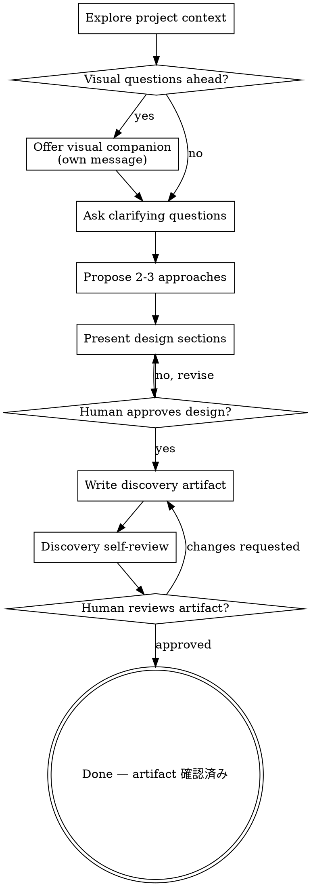

# Brainstorming Ideas Into Documents

自然な対話を通じて、アイデアを十分に形成された design と downstream document
へ変換します。

この skill は design gate workflow を、このパッケージの `docs/discovery/`
artifact と spec/ADR routing に対応させます。

まず現在のプロジェクト文脈を理解します。その後、一度に一つずつ質問して
アイデアを磨きます。何を作るのか理解できたら、design を提示し、人間の
承認を得ます。

<HARD-GATE>
design を提示し人間が承認するまで、implementation skill を起動したり、
コードを書いたり、プロジェクトを scaffold したり、実装アクションを取ったり
しないでください。これは簡単に見える作業にも適用します。
</HARD-GATE>

## Anti-Pattern: "This Is Too Simple To Need A Design"

すべての project はこのプロセスを通ります。todo list、単一関数 utility、
config 変更、document workflow 更新も同じです。単純な作業ほど、未確認の
前提で無駄が起きます。小さな変更なら design は数文で構いませんが、実装前に
存在し、承認される必要があります。

## チェックリスト

次を順番に完了します。

1. **プロジェクト文脈を探索する** - files、docs、ADR、spec、plan、task、
   recent commits、関連 tests を確認する。
2. **visual companion を提案する** - 視覚的 design、diagram、layout 判断が
   出そうな場合。環境が対応するなら、この提案は単独メッセージにします。
3. **clarifying questions を聞く** - 一度に一つずつ。purpose、constraints、
   users、scope、success criteria を理解します。
4. **2-3 個の approach を提示する** - trade-off と recommendation 付き。
5. **design を提示する** - 複雑さに応じた粒度で、必要なら section ごとに
   承認を得る。
6. **discovery artifact を書く** - YAML フロントマター + Markdown で
   `docs/discovery/` に保存する。
7. **discovery self-review** - placeholder、矛盾、曖昧さ、routing 欠落、
   scope 過多を確認する。
8. **人間が written discovery artifact を review する** - downstream 作業前に確認する。
9. **完了** — 確認済み artifact が downstream documentation
   （spec, ADR, design, plan, task）の入力となる。

## Process Flow



terminal state は確認済み discovery artifact です。brainstorming 後にコードを
書かないでください。artifact は downstream documentation の入力となります。

## プロセス

### アイデアを理解する

- 現在の project state を最初に確認する。files、docs、recent commits、
  package manifests、tests、ADR、spec、plan、task、discovery artifact。
- 詳細質問の前に scope を評価する。複数の独立 subsystem を含む場合はすぐに
  指摘し、先に分解します。
- 1 つの downstream document に大きすぎる場合は sub-project に分解する。
  独立部分、関係、安全な順序を明らかにし、最初の sub-project を通常 flow で
  brainstorming します。
- 適切な scope なら、一度に一つずつ質問する。
- 明確な選択肢がある場合は multiple-choice を優先してよいが、曖昧さが本物
  なら open-ended question も使う。
- 一度のメッセージで質問は一つだけ。深掘りが必要なら小さく分ける。
- purpose、target users、constraints、success criteria、risks、document
  routing に集中する。

### approach を探索する

- 2-3 個の異なる approach を trade-off 付きで提示する。
- recommendation と reasoning を会話的に示す。
- 根拠があるなら recommended option から提示する。
- 偽の選択肢を作らない。各 option は意味のある違いを持つ。
- 各 approach が ADR、spec、plan、task のどれを必要とするか識別する。

### design を提示する

何を作る、または何を決めるべきか理解できたら design を提示します。

- 複雑さに応じて section を調整する。単純なら数文、境界や trade-off が
  複雑なら詳細に。
- incremental validation が risk を下げる場合は section ごとに確認する。
- 必要に応じて architecture、components、data flow、user flow、error
  handling、testing、rollout、documentation routing を扱う。
- 意味が通らない点があれば戻って確認する。

### isolation と clarity のために設計する

- system を、明確な目的を持つ小さな unit に分ける。
- 各 unit の使い方と依存を定義する。
- 内部を読まずに intent が分かる boundary を優先する。
- 内部変更で consumer が壊れるなら boundary が不十分。
- 小さく境界の明確な unit は agent が推論しやすい。file や document が大きく
  なりすぎる場合は、責務過多の signal です。

### 既存 codebase で作業する

- 変更提案の前に現在の構造を探索する。
- 明示的に変える作業でない限り、既存 pattern に従う。
- 既存 code/docs の問題が作業に影響するなら、targeted improvement として
  design に含める。
- 無関係な refactoring は提案しない。現在の goal に集中する。
- routing decision は repo evidence に接地する。たとえば dependency choice
  や新しい architecture pattern は通常 `adr-doc`、user-facing product scope
  と implementation behavior は `spec-doc` が必要です。

## Design 後

### Documentation

validated discovery artifact を `docs/discovery/` に書きます。

```bash
node scripts/new_brainstorm.js --title "Onboarding discovery"
node scripts/new_brainstorm.js --title "Onboarding discovery" --from docs/ideas/0001-improve-onboarding.md
```

生成文書は YAML フロントマターを持ちます。

```yaml
---
id: "BRAINSTORM-0001"
type: "brainstorm"
status: "capturing"
title: "Onboarding discovery"
created: "YYYY-MM-DD"
updated: "YYYY-MM-DD"
owners: []
relations:
  source: []
  implements: []
  implemented-by: []
  depends-on: []
  blocks: []
  supersedes: []
  superseded-by: []
  related: []
  refines: []
  refined-by: []
  derives-from:
    - "docs/ideas/0001-improve-onboarding.md"
  derived-by: []
  verifies: []
  verified-by: []
  references: []
---
```

idea artifact や上流文書への link は `relations.derives-from` に記録します。
この discovery から作られた ADR、spec、plan、task は後から
`relations.derived-by` に記録します。

ステータス値:

- `capturing`: discussion を収集中
- `confirmed`: 人間が captured intent と design を確認済み
- `routed`: downstream document が作成済み、または明示的に選択済み
- `superseded`: 新しい discovery artifact に置き換え済み

### Discovery Artifact Template

```markdown
# [Discovery Title]

## Intent

[Goal, target user, reason this matters now.]

## Constraints

- [Technical, product, operational, timeline, policy, or team constraint]

## Options

### Option 1

[Description, trade-offs, and when it wins.]

### Option 2

[Description, trade-offs, and when it wins.]

### Option 3

[Description, trade-offs, and when it wins.]

## Recommendation

[Recommended option and why.]

## Open Questions

- [Question that blocks downstream documents or implementation]

## Document Routing

- [ ] ADR needed: [why or why not]
- [ ] Spec needed: [why or why not]
- [ ] Plan ready: [why or why not]
- [ ] Task breakdown ready: [why or why not]

## Confirmed Summary

[The agreed intent, scope, non-goals, and success criteria.]
```

この discovery artifact が `adr-doc` にルーティングされる場合、ADR Phase 1 の
上流コンテキストとして機能します。ADR skill はこの artifact から判断に
関連する情報（トリガー、制約、選択肢、推奨案）を抽出し、人間に同じ
質問を繰り返しません。ADR 固有の不足分（ガバナンス、エージェント実装
詳細、検証基準）のみをフォローアップで質問します。

### Discovery Self-Review

discovery artifact を書いた後、 fresh eyes で確認します。

1. Placeholder scan: `TBD`, `TODO`, incomplete section、曖昧な requirement がない。
2. Internal consistency: intent、options、recommendation、routing が矛盾しない。
3. Scope check: 1 つの downstream ADR/spec/plan path に収まるか、明示的に
   decomposed されている。
4. Ambiguity check: requirement が 2 通りに読めるなら、選ぶか質問する。
5. Routing check: ADR、spec、plan、task の判断が明示されている。

明らかな cleanup はその場で修正します。

### Human Review Gate

self-review 後、人間に written discovery artifact の review を依頼します。

```text
Discovery written to <path>. Please review it and tell me if you want changes
before we create the ADR, spec, plan, or tasks.
```

返答を待ちます。変更が必要なら修正し、self-review を再実行します。承認後だけ
次へ進みます。

### Implementation

- brainstorming から直接実装しない。
- `adr-doc`、`spec-doc`、`plan-doc`、`task-doc` に route する。
- 急いでいても、短い confirmed discovery artifact と明示的 routing decision
  を先に作る。

## Key Principles

- 質問は一度に一つ。人間を圧倒しない。
- 選択肢が明確なら multiple-choice question は有効。
- YAGNI を徹底する。不要な scope を design から外す。
- 決める前に alternatives を探索する。
- incremental に validate する。design を提示し、承認を得て、document 化する。
- 意味が通らなければ戻って確認する。
- `relations.source`, `relations.derives-from`, `relations.derived-by` で
  document provenance を保存する。

## Visual Companion

環境が対応している場合、browser-based companion は mockup、diagram、visual
option に有用です。承諾されたからといって全質問を browser 経由にする必要は
ありません。

### 提案方法

mockup、layout、diagram、side-by-side visual design など、今後の質問が
視覚的 content を含みそうな場合は一度だけ提案します。

```text
Some of what we're working on might be easier to explain if I can show it to you
in a web browser. I can put together mockups, diagrams, comparisons, and other
visuals as we go. This feature can be token-intensive. Want to try it?
```

この提案は単独メッセージにします。clarifying question、context summary、
無関係な内容と混ぜません。断られたら text-only で進めます。

### 質問ごとの判断

見せた方が読むより理解しやすい場合だけ browser / visual companion を使います。

- mockup、wireframe、layout comparison、architecture diagram、visual design
  choice には visual を使う。
- requirements question、conceptual choice、trade-off list、scope decision、
  document routing には text を使う。

UI topic だから必ず visual ではありません。personality や product positioning
は conceptual です。wizard layout は visual が有効な場合があります。
