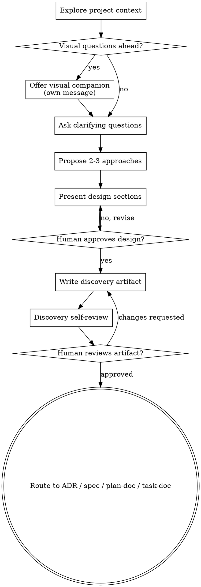

# Brainstorming Ideas Into Documents

Help turn ideas into fully formed designs and downstream documents through
natural collaborative dialogue.

This skill maps a design-gate workflow to this package's `docs/discovery/`
artifacts and ADR/spec routing.

Start by understanding the current project context. Then ask questions one at a
time to refine the idea. Once you understand what is being built, present the
design and get human approval.

<HARD-GATE>
Do not invoke an implementation skill, write code, scaffold a project, or take
an implementation action until you have presented a design and the human has
approved it. This applies regardless of perceived simplicity.
</HARD-GATE>

## Anti-Pattern: "This Is Too Simple To Need A Design"

Every project goes through this process. A todo list, a single-function utility,
a config change, a document workflow update: all of them. Simple projects are
where unexamined assumptions cause wasted work. The design can be short for
small changes, but it must exist and be approved before implementation.

## Checklist

Complete these items in order:

1. **Explore project context** - check files, docs, ADRs, specs, plans, tasks,
   recent commits, and relevant tests.
2. **Offer visual companion** if upcoming questions involve visual design,
   diagrams, or layout decisions. This offer must be its own message when the
   environment supports it.
3. **Ask clarifying questions** one at a time to understand purpose,
   constraints, users, scope, and success criteria.
4. **Propose 2-3 approaches** with trade-offs and a recommendation.
5. **Present design** in sections scaled to the complexity, and get approval
   after each section when useful.
6. **Write discovery artifact** to `docs/discovery/` with YAML front matter plus
   Markdown.
7. **Discovery self-review** for placeholders, contradictions, ambiguity,
   missing routing, and excessive scope.
8. **Human reviews written discovery artifact** before downstream ADR,
   spec, plan, task, or implementation work.
9. **Transition to downstream documents** using the minimum necessary route:
   ADR, spec, `plan-doc`, or `task-doc`.

## Process Flow



The terminal state is routing into downstream documents. Do not write code after
brainstorming. The next step is one or more of:

- `adr-doc` when the work involves architecture, dependencies, irreversible
  choices, or cross-cutting conventions.
- `spec-doc` when what should be built, why it is needed, who it serves, scope,
  behavior, API, workflow, acceptance criteria, and verification must be
  precise.
- `plan-doc` only when an upstream ADR or spec is already clear and
  approved enough to implement.
- `task-doc` only when the plan is already decomposed and ready for execution
  tracking.

## The Process

### Understanding the Idea

- Check the current project state first: files, docs, recent commits, package
  manifests, tests, ADRs, specs, plans, tasks, and existing discovery artifacts.
- Before detailed questions, assess scope. If the request describes multiple
  independent subsystems, flag that immediately. Do not refine details of a
  project that needs decomposition first.
- If the project is too large for one downstream document, decompose it into
  sub-projects. Identify independent pieces, their relationships, and a safe
  order. Then brainstorm the first sub-project through the normal flow.
- For appropriately scoped work, ask questions one at a time.
- Prefer multiple-choice questions when they reduce friction, but open-ended
  questions are acceptable when the ambiguity is real.
- Only ask one question per message. If a topic needs more exploration, break it
  into smaller questions.
- Focus on purpose, target users, constraints, success criteria, risks, and
  document routing.

### Exploring Approaches

- Propose 2-3 different approaches with trade-offs.
- Present options conversationally with a recommendation and reasoning.
- Lead with the recommended option when the evidence supports it.
- Avoid fake alternatives. Each option should be meaningfully different.
- Identify whether each approach requires ADR, spec, plan, or task
  documents.

### Presenting the Design

Once you believe you understand what should be built or decided, present the
design.

- Scale each section to complexity: a few sentences for straightforward work,
  more detail when boundaries or trade-offs are nuanced.
- Ask after each section whether it looks right when incremental validation
  would reduce risk.
- Cover architecture, components, data flow, user flow, error handling, testing,
  rollout, and documentation routing as applicable.
- Be ready to go back and clarify when something does not make sense.

### Design for Isolation and Clarity

- Break systems into smaller units with one clear purpose.
- Define how each unit is used and what it depends on.
- Prefer boundaries that allow readers and agents to understand intent without
  reading internals.
- If a unit cannot be changed internally without breaking consumers, the
  boundary is not clear enough.
- Smaller, well-bounded units are easier for agents to reason about. When a file
  or document grows large, that is often a signal that it is doing too much.

### Working in Existing Codebases

- Explore current structure before proposing changes.
- Follow existing patterns unless the work is explicitly about changing them.
- If existing code or docs have problems that affect the work, include targeted
  improvements in the design.
- Do not propose unrelated refactoring. Stay focused on what serves the current
  goal.
- Ground routing decisions in repo evidence. For example, dependency choices or
  new architectural patterns usually need `adr-doc`; user-facing product scope
  and implementation behavior need `spec-doc`.

## After the Design

### Documentation

Write the validated discovery artifact to `docs/discovery/` using:

```bash
node scripts/new_brainstorm.js --title "Onboarding discovery"
node scripts/new_brainstorm.js --title "Onboarding discovery" --from docs/ideas/0001-improve-onboarding.md
```

Generated documents use YAML front matter:

```yaml
---
id: "BRAINSTORM-0001"
type: "brainstorm"
status: "capturing"
title: "Onboarding discovery"
created: "YYYY-MM-DD"
updated: "YYYY-MM-DD"
owners: []
relations:
  source: []
  implements: []
  implemented-by: []
  depends-on: []
  blocks: []
  supersedes: []
  superseded-by: []
  related: []
  refines: []
  refined-by: []
  derives-from:
    - "docs/ideas/0001-improve-onboarding.md"
  derived-by: []
  verifies: []
  verified-by: []
  references: []
---
```

Use `relations.derives-from` to link upstream idea artifacts or source
documents. Use `relations.derived-by` later to point at ADR, spec, plan, or
task documents created from the brainstorming result.

Status values:

- `capturing`: discussion is still being gathered
- `confirmed`: human has confirmed the captured intent and design
- `routed`: downstream documents have been created or explicitly selected
- `superseded`: replaced by a newer discovery artifact

### Discovery Artifact Template

```markdown
# [Discovery Title]

## Intent

[Goal, target user, reason this matters now.]

## Constraints

- [Technical, product, operational, timeline, policy, or team constraint]

## Options

### Option 1

[Description, trade-offs, and when it wins.]

### Option 2

[Description, trade-offs, and when it wins.]

### Option 3

[Description, trade-offs, and when it wins.]

## Recommendation

[Recommended option and why.]

## Open Questions

- [Question that blocks downstream documents or implementation]

## Document Routing

- [ ] ADR needed: [why or why not]
- [ ] Spec needed: [why or why not]
- [ ] Plan ready: [why or why not]
- [ ] Task breakdown ready: [why or why not]

## Confirmed Summary

[The agreed intent, scope, non-goals, and success criteria.]
```

### Discovery Self-Review

After writing the discovery artifact, review it with fresh eyes:

1. Placeholder scan: no `TBD`, `TODO`, incomplete sections, or vague
   requirements.
2. Internal consistency: no contradiction between intent, options,
   recommendation, and routing.
3. Scope check: focused enough for one downstream ADR/spec/plan path, or
   explicitly decomposed.
4. Ambiguity check: if a requirement can be interpreted two ways, pick one or
   ask before proceeding.
5. Routing check: ADR, spec, plan, and task decisions are explicit.

Fix issues inline. No separate review loop is needed for obvious cleanup.

### Human Review Gate

After the self-review passes, ask the human to review the written discovery
artifact before proceeding:

```text
Discovery written to <path>. Please review it and tell me if you want changes
before we create the ADR, spec, plan, or tasks.
```

Wait for the response. If changes are requested, make them and re-run the
self-review. Proceed only after approval.

### Implementation

- Do not implement directly from brainstorming.
- Route into `adr-doc`, `spec-doc`, `plan-doc`, or `task-doc`.
- If implementation pressure is high, still produce a short confirmed discovery
  artifact and explicit routing decision first.

## Key Principles

- One question at a time. Do not overwhelm the human.
- Multiple-choice questions are useful when choices are clear.
- YAGNI ruthlessly. Remove unnecessary scope from designs.
- Explore alternatives before settling.
- Validate incrementally. Present design, get approval, then document.
- Be flexible. Go back and clarify when something does not make sense.
- Preserve document provenance with `relations.source`, `relations.derives-from`,
  and `relations.derived-by`.

## Visual Companion

A browser-based companion can help with mockups, diagrams, and visual options
when the environment supports it. Accepting the companion means it is available
for questions that benefit from visual treatment; it does not mean every
question goes through the browser.

### Offering the Companion

When upcoming questions involve visual content such as mockups, layouts,
diagrams, or side-by-side visual designs, offer it once for consent:

```text
Some of what we're working on might be easier to explain if I can show it to you
in a web browser. I can put together mockups, diagrams, comparisons, and other
visuals as we go. This feature can be token-intensive. Want to try it?
```

This offer should be its own message. Do not combine it with clarifying
questions, context summaries, or unrelated content. If the human declines,
proceed text-only.

### Per-Question Decision

Use the browser or visual companion only when the human would understand the
question better by seeing it than by reading it.

- Use visuals for mockups, wireframes, layout comparisons, architecture
  diagrams, and visual design choices.
- Use text for requirements questions, conceptual choices, trade-off lists,
  scope decisions, and document routing.

A UI topic is not automatically visual. A question about personality or product
positioning is conceptual. A question about wizard layout can benefit from
visual treatment.
