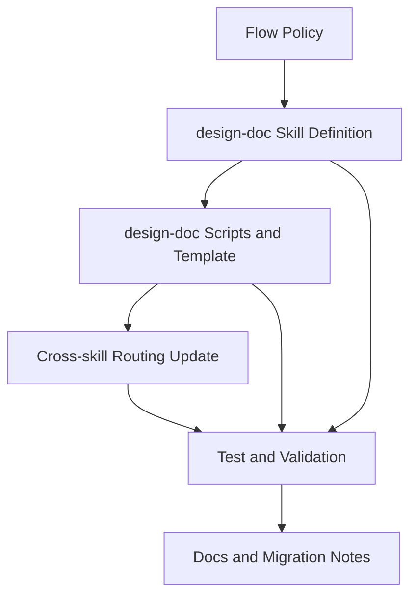

# Plan: doc-driven-dev に設計フェーズを追加

## Overview

`doc-driven-dev-apm` の既存 mainline は `brainstorming -> spec + ADR (parallel) -> plan -> task` です。
この流れに、成果物として追跡可能な設計フェーズ（以下 `design-doc`）を追加します。

狙いは次の 3 点です。

1. `brainstorming` の対話内 design を、再利用可能な文書成果物に昇格する。
2. `spec` (what/why) と `ADR` (decision/rationale) を、実装前に設計観点で束ねる。
3. `plan-doc` が参照する上流根拠を増やし、実装計画の抜け漏れを減らす。

提案する新しい標準フロー:

`idea-refine or brainstorming -> spec + ADR (parallel) -> design-doc -> plan-doc -> task-doc`

`design-doc` は必須フェーズとして導入し、`plan-doc` 作成前に常に作成・承認します。

## Dependency Graph

依存の要点:

- 先にフロー方針を決めないと、`design-doc` の relation と status が定義できない。
- `design-doc` skill 本体がないと、他 skill の route 追記が片手落ちになる。
- 最後に test とドキュメントを更新して互換性を担保する。

## Architecture Decisions

- AD-1: 新規 skill として `design-doc` を追加する。
  既存の `brainstorming` に埋め込まず、`docs/designs/` の独立成果物として扱う。
- AD-2: `plan-doc` は `design-doc` を `relations.derives-from` で参照可能にする。
  既存の `spec/ADR` 参照を壊さずに拡張する。
- AD-3: `design-doc` を hard-gate とする。
  `plan-doc` は承認済み `design-doc` が存在する場合のみ作成可能にする。
- AD-4: 既存互換を維持する。
  現行の spec/ADR/plan/task の script 引数や既存 test を破壊しない。

## Hard-Gate Contract (Fixed)

`plan-doc` 作成時の拒否条件と判定ルールを次で固定する。

- エラーメッセージ文言（固定）:
  `PLAN-DOC-GATE-001: approved design-doc is required before creating a plan. Ensure docs/designs/overview.md exists and provide at least one design doc with front matter status: "approved".`
- approved 判定ルール（固定）:
  - YAML front matter の `status` が文字列で厳密一致 `approved` のときのみ承認済みとみなす。
  - 大文字小文字違い（例: `Approved`）、別値（例: `draft`, `proposed`, `in-review`, `superseded`）は非承認扱い。
  - `overview.md` は必須ファイルだが、これ単体では承認済み design-doc としては数えない。
  - `plan-doc` 入力で参照する design 文書のうち、少なくとも 1 件が上記判定で承認済みであることを必須とする。

## Directory Contract

design 成果物ディレクトリは `docs/designs/` とし、全体設計を最初に把握できるよう
`overview.md` を必須ファイルとして配置する。

- `docs/designs/overview.md`: 全体設計（システム境界、主要コンポーネント、
  データフロー、非機能制約、詳細設計文書へのリンク）
- `docs/designs/0001-<slug>.md` 以降: 詳細設計（機能単位・変更単位）
- `docs/designs/README.md`: 索引（overview と詳細設計を一覧化）

閲覧順序は `overview.md` -> 各詳細設計とする。

## Task List

### Phase 1: Foundation (方針とスキーマ)

#### Task 1: 設計フェーズの運用方針とライフサイクルを定義

**Description:**
`design-doc` の目的、必須/任意条件、status 遷移、relation ルールを定義する。

**Acceptance criteria:**
- [ ] 新フローを `README.md` / `README.ja.md` に明記。
- [ ] `design-doc` の status 値（例: `draft`, `approved`, `superseded`）が定義される。
- [ ] `plan-doc` への受け渡し条件（design 承認済みが必須）が記述される。

**Verification:**
- [ ] ドキュメント上で旧フロー表記が新フローに更新されている。
- [ ] `pnpm run lint:md` が通る。

**Dependencies:** None

**Files likely touched:**
- `README.md`
- `README.ja.md`
- `.apm/skills/plan-doc/references/plan-conventions.md`
- `.apm/skills/plan-doc/references/plan-conventions.ja.md`

**Estimated scope:** Medium

#### Task 2: `design-doc` スキル骨格を追加（定義・テンプレート・参照）

**Description:**
`.apm/skills/design-doc/` を追加し、`SKILL.md`/`SKILL.ja.md`、conventions、template を作る。

**Acceptance criteria:**
- [ ] `.apm/skills/design-doc/SKILL.md` と `SKILL.ja.md` が存在。
- [ ] `references/design-conventions(.ja).md` が存在。
- [ ] `assets/templates/design(.ja).md` が存在。

**Verification:**
- [ ] `tests/doc-suite.test.ts` に存在確認ケースを追加して pass。
- [ ] `pnpm test` が通る。

**Dependencies:** Task 1

**Files likely touched:**
- `.apm/skills/design-doc/**`
- `tests/doc-suite.test.ts`

**Estimated scope:** Medium

### Checkpoint: Foundation

- [ ] フロー定義と `design-doc` の静的資材が揃っている。
- [ ] 既存テストの回帰がない。
- [ ] 人間レビューで「導入方針」に合意できる。

### Phase 2: Vertical Slices (1 タスク = 1 完結経路)

#### Task 3: Vertical Slice A - `design-doc` 作成から索引更新まで

**Description:**
`src/skills/design-doc/scripts/new_design.ts` と `update_index.ts` を実装し、
`docs/designs/` に最小の設計文書を生成できるようにする。

**Acceptance criteria:**
- [ ] `new_design` 実行で front matter 付き design 文書が生成される。
- [ ] `docs/designs/overview.md` が存在し、未作成時は初回生成される。
- [ ] design index (`docs/designs/README.md`) が更新される。
- [ ] `relations.derives-from` に spec/ADR/discovery を記録できる。

**Verification:**
- [ ] 新規テストで `new_design.js` の生成と relation を検証。
- [ ] 新規テストで `overview.md` の存在と最小必須セクションを検証。
- [ ] `pnpm run build:scripts` 後に `.apm/skills/design-doc/scripts/*.js` が生成される。
- [ ] `pnpm test` が通る。

**Dependencies:** Task 2

**Files likely touched:**
- `src/skills/design-doc/scripts/new_design.ts`
- `src/skills/design-doc/scripts/update_index.ts`
- `.apm/skills/design-doc/scripts/*.js` (build output)
- `tests/doc-suite.test.ts`

**Estimated scope:** Medium

#### Task 4: Vertical Slice B - `brainstorming` から `design-doc` へルーティング

**Description:**
`brainstorming` の downstream routing に `design-doc` を追加し、
「いつ design を先に作るべきか」の判断基準を明文化する。

**Acceptance criteria:**
- [ ] `brainstorming` の flow と routing bullet に `design-doc` が追加される。
- [ ] ルーティング条件（複数 subsystem、複雑 UI、非自明な data flow）が記載される。
- [ ] discovery から design への relation 方針が記載される。

**Verification:**
- [ ] `SKILL.md` / `SKILL.ja.md` の整合が取れている。
- [ ] `pnpm run lint:md` が通る。

**Dependencies:** Task 2

**Files likely touched:**
- `.apm/skills/brainstorming/SKILL.md`
- `.apm/skills/brainstorming/SKILL.ja.md`

**Estimated scope:** Small

#### Task 5: Vertical Slice C - `plan-doc` が `design-doc` を利用できる状態にする

**Description:**
`plan-doc` の規約・テンプレート・作成スクリプトを拡張し、
`design-doc` を上流として取り込めるようにする。

**Acceptance criteria:**
- [ ] `new_plan` で design 文書を `relations.derives-from` に追加できる。
- [ ] `plan` テンプレートに design 参照セクションがある。
- [ ] design 不在または未承認時は、固定文言 `PLAN-DOC-GATE-001` で plan 作成を拒否する。

**Verification:**
- [ ] `doc-suite.test.ts` に plan-design 連携テストを追加し pass。
- [ ] `status: approved` の design を与えた場合のみ plan 作成が成功するテストを追加。
- [ ] `status: draft/proposed` または `Approved` の design を与えた場合に `PLAN-DOC-GATE-001` で失敗するテストを追加。
- [ ] 既存 `new_plan` テストが壊れない。
- [ ] `pnpm test` が通る。

**Dependencies:** Task 3, Task 4

**Files likely touched:**
- `src/skills/plan-doc/scripts/new_plan.ts`
- `.apm/skills/plan-doc/assets/templates/plan.md`
- `.apm/skills/plan-doc/assets/templates/plan.ja.md`
- `tests/doc-suite.test.ts`

**Estimated scope:** Medium

### Checkpoint: Core Flow

- [ ] `brainstorming -> design-doc -> plan-doc` の最短経路が動作する。
- [ ] `spec + ADR -> design-doc -> plan-doc` の必須経路が常に適用される。
- [ ] 人間レビューで hard-gate 方針を再確認する。

### Phase 3: Hardening and Rollout

#### Task 6: `doc-status` と監査観点へ design を統合

**Description:**
`doc-status` の list/audit 対象に `design` type を追加し、
ステータス・relation・index の監査ができるようにする。

**Acceptance criteria:**
- [ ] `--type design` が `list_docs` と `audit_docs` で使える。
- [ ] design 文書の required front matter が検証される。
- [ ] `docs/designs/overview.md` の存在チェックとリンク整合チェックを実施できる。
- [ ] index 欠落や relation 欠落を finding として検出できる。

**Verification:**
- [ ] `doc-status` 系テストに design ケースを追加。
- [ ] `pnpm test` が通る。

**Dependencies:** Task 3

**Files likely touched:**
- `src/skills/doc-status/scripts/list_docs.ts`
- `src/skills/doc-status/scripts/audit_docs.ts`
- `tests/doc-suite.test.ts`

**Estimated scope:** Medium

#### Task 7: 導入ガイドと移行メモを整備

**Description:**
既存利用者向けに「いつ design-doc を作るか」「既存 plan をどう扱うか」を整理し、
段階導入の運用ガイドを追記する。

**Acceptance criteria:**
- [ ] README と AGENTS に設計フェーズの導入方針が反映。
- [ ] 既存プロジェクト向け移行手順（必須ではないが推奨）がある。
- [ ] コマンド例が英日で更新される。

**Verification:**
- [ ] `pnpm run lint:md` が通る。
- [ ] 文書内の flow 表記がすべて一致する。

**Dependencies:** Task 5, Task 6

**Files likely touched:**

- `README.md`
- `README.ja.md`
- `AGENTS.md`
- `AGENTS.ja.md`

**Estimated scope:** Small

### Checkpoint: Release Readiness

- [ ] `pnpm run build:scripts` 実行済み。
- [ ] `pnpm test` 全 pass。
- [ ] `pnpm run lint:md` 全 pass。
- [ ] `apm compile --dry-run` が成功（`--validate` は参考扱い）。
- [ ] 互換性影響と移行方針を human が承認。

## Risks and Mitigations

| Risk | Impact | Mitigation |
| --- | --- | --- |
| design-doc が spec/ADR と重複して冗長化する | High | `design-doc` の責務を「構成・境界・フロー可視化」に限定し、what/why は spec、意思決定は ADR に寄せる。 |
| 既存ユーザーが hard-gate により運用変更を迫られる | High | 移行ガイドを提供し、既存案件には `overview.md` + 最小 design テンプレートで段階移行する。 |
| 文書タイプ追加で監査ロジックが壊れる | Medium | `doc-status` の type 列挙と fixture テストを追加。 |
| 英日ドキュメントの不整合 | Medium | 同一差分を英日同時更新し、レビュー時に差分チェック。 |

## Open Questions for Human Review

- [ ] `design-doc` の標準保存先を `docs/designs/` に固定してよいか。
- [ ] 既存 `brainstorming` の「design を提示する」節を軽量化し、成果物作成へ寄せるか。

## Human Review Request

この計画は実装前レビュー用です。特に次を確認してください。

1. 新フロー `spec+ADR -> design -> plan` の妥当性
2. hard-gate 導入方針の妥当性
3. Task 3-5 の順序（vertical slice）の妥当性
