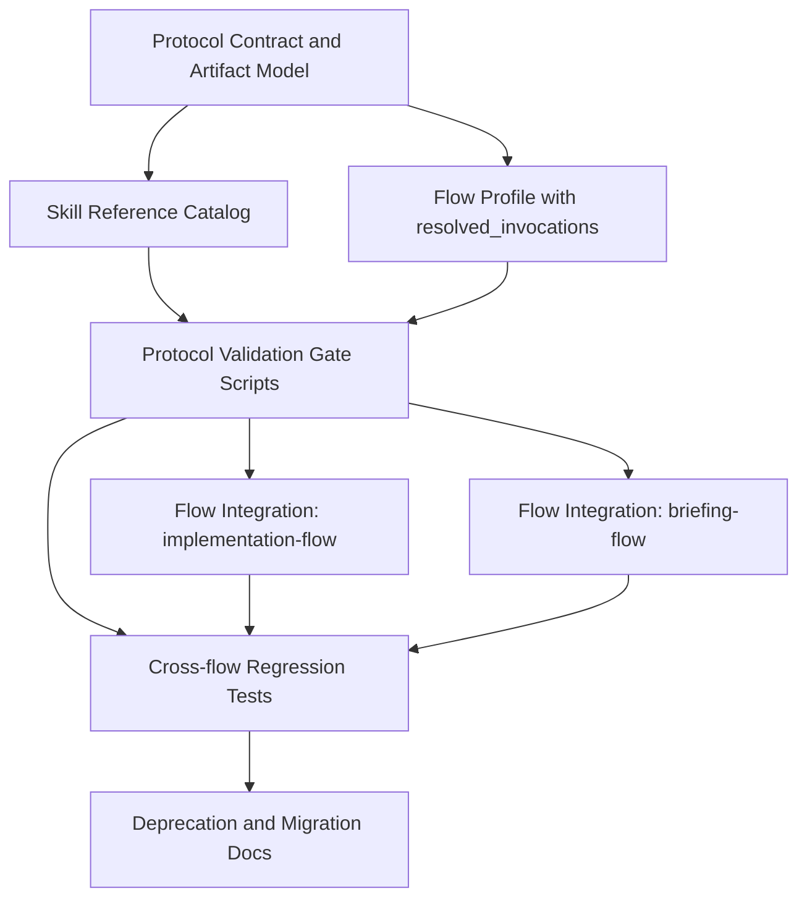

# Implementation Plan: skill-discovery-protocol 汎用化とフロー置換

## Overview

`implementation-flow` と `briefing-flow` が個別に持つ discovery protocol を、
再利用可能な単独スキル `skill-discovery-protocol` として再定義する。

### Goals

1. プロトコル定義を flow 固有記述から分離し、他スキルでも流用できる共通仕様にする
2. 生成・更新・検証をすべてスクリプト経由に統一し、手作業差分を排除する
3. フォーマットの厳格性、再現性、冪等性をゲートで担保する
4. `implementation-flow` と `briefing-flow` を段階的に置換して運用を切り替える
5. 2 層モデル（Skill Reference Catalog / Flow Profile）を採用する

### Two-layer Model

### Key Dependencies

- 先に共通契約を固定しないと、フロー側置換時に仕様差分が発散する
- 生成スクリプトと検証ゲートは同時設計が必要
- フロー置換は独立に進められるが、最終完了判定は両方のゲート通過が必須

## Documents

| Document | Path |
| --- | --- |
| Architecture Decisions | [tasks/decisions.md](decisions.md) |
| Risks and Mitigations | [tasks/risks.md](risks.md) |
| Phase 1: Foundation | [tasks/phases/phase-1-foundation.md](phases/phase-1-foundation.md) |
| Phase 2: Vertical Slices | [tasks/phases/phase-2-vertical-slices.md](phases/phase-2-vertical-slices.md) |
| Phase 3: Hardening | [tasks/phases/phase-3-hardening.md](phases/phase-3-hardening.md) |
| TODO tracker | [tasks/todo.md](todo.md) |

## Specifications

| Document | Path |
| --- | --- |
| 全体像 | [docs/specs/skills/skill-discovery-protocol/overview.md](../docs/specs/skills/skill-discovery-protocol/overview.md) |
| Adapter YAML Schema | [docs/specs/skills/skill-discovery-protocol/adapter-schema.md](../docs/specs/skills/skill-discovery-protocol/adapter-schema.md) |
| Skill Reference Catalog | [docs/specs/skills/skill-discovery-protocol/skill-reference-catalog.md](../docs/specs/skills/skill-discovery-protocol/skill-reference-catalog.md) |
| Flow Profile | [docs/specs/skills/skill-discovery-protocol/flow-profile.md](../docs/specs/skills/skill-discovery-protocol/flow-profile.md) |
| Validation Report | [docs/specs/skills/skill-discovery-protocol/validation-report.md](../docs/specs/skills/skill-discovery-protocol/validation-report.md) |
| sdp CLI | [docs/specs/skills/skill-discovery-protocol/sdp-cli.md](../docs/specs/skills/skill-discovery-protocol/sdp-cli.md) |
| Gates | [docs/specs/skills/skill-discovery-protocol/gates.md](../docs/specs/skills/skill-discovery-protocol/gates.md) |

## Phase Summary

| Phase | Tasks | Focus |
| --- | --- | --- |
| 1: Foundation | Task 1-2 | 共通契約定義 + script-only 運用規約 |
| 2: Vertical Slices | Task 3-6 | パイプライン実装 + ゲート + flow 置換 |
| 3: Hardening | Task 7-8 | 回帰テスト + 移行ガイド |

## Existing Sources

- `.apm/skills/implementation-flow/SKILL.md`
- `.apm/skills/implementation-flow/references/skill-discovery-protocol.md`
- `.apm/skills/implementation-flow/references/implementation-profile-schema.md`
- `.apm/skills/briefing-flow/SKILL.md`
- `.apm/skills/briefing-flow/references/briefing-discovery-protocol.md`
- `.apm/skills/briefing-flow/references/briefing-profile-schema.md`
- `tests/doc-suite.test.ts`
- `scripts/build-skill-scripts.ts`
