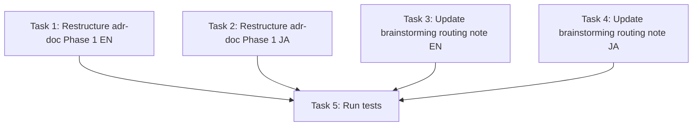

# Plan: Resolve ADR Phase 1 Socratic vs Brainstorming Overlap

## Problem Statement

`adr-doc` Phase 1 ("Capture Intent — Socratic") duplicates significant portions
of `brainstorming`'s questioning flow. When the lifecycle is:

```
brainstorming → adr-doc (parallel with spec)
```

The human answers the same questions twice:

| Topic | Brainstorming asks | ADR Phase 1 asks |
|-------|-------------------|-----------------|
| Purpose/trigger | "purpose, constraints, users" | Q1 "What are you deciding?" Q2 "Why now?" |
| Constraints | "constraints, success criteria" | Q3 "What constraints exist?" |
| Options | "Propose 2-3 approaches" | Q5 "What options have you considered?" |
| Success | "success criteria" | Q4 "What does success look like?" |
| Recommendation | "recommendation and reasoning" | Q6 "What is your current lean?" |

The overlap is ~70% of Phase 1's core questions. Only Q7 (who approves) and
Q8 (what does an agent need to implement) are ADR-specific and not covered by
brainstorming.

## Analysis: Why the Overlap Exists

Both skills evolved from different perspectives:
- **Brainstorming** = "explore the problem space, find the design"
- **ADR Phase 1** = "capture the decision context for permanent record"

They converge because both need the same raw information (constraints, options,
rationale) but for different outputs:
- Brainstorming → discovery artifact (temporary, routes downstream)
- ADR Phase 1 → feeds directly into ADR draft (permanent record)

## Key Insight

With the parallel model, there are **two entry paths** to `adr-doc`:

1. **With upstream brainstorming**: Discovery artifact already contains most
   Phase 1 answers. Re-asking is redundant.
2. **Cold start (no upstream)**: ADR triggered mid-implementation or for a
   cross-cutting decision with no prior brainstorming. Full questioning needed.

## Proposed Solution: Dual-Mode Phase 1

Split Phase 1 into two modes based on whether upstream context exists:

### Mode A: "Extract from upstream" (brainstorming/spec exists)

When the ADR follows brainstorming or is created parallel with a spec:

1. **Read the upstream artifact** (discovery doc, spec, or both).
2. **Extract and map** the decision-relevant information into ADR structure:
   - Title ← discovery recommendation + routing note
   - Trigger ← discovery intent / "why now"
   - Constraints ← discovery constraints section
   - Options ← discovery options section
   - Lean ← discovery recommendation
   - Non-goals ← discovery scope exclusions
3. **Ask only for gaps** — typically:
   - Q7: Who approves? (governance, not product)
   - Q8: What does an agent need to implement? (file-level detail)
   - Any constraint or option NOT captured upstream
   - Verification criteria (how to prove implementation is correct)
4. **Present Intent Summary Gate** as normal.

This mode respects the human's time: they already answered during brainstorming.

### Mode B: "Full Socratic" (cold start)

When the ADR is triggered without upstream brainstorming:
- During implementation (proactive trigger)
- Cross-cutting decision not tied to any feature
- Standalone architecture decision

Keep the current full 8-question Socratic flow unchanged.

### Mode Selection Logic

```
IF upstream discovery artifact OR spec exists for this decision:
  → Mode A (extract + gap-fill)
ELSE:
  → Mode B (full Socratic)
```

## What Changes

| File | Current | Proposed |
|------|---------|----------|
| `adr-doc/SKILL.md` Phase 1 | Single monolithic Socratic flow | Two modes with selection logic |
| `adr-doc/SKILL.ja.md` Phase 1 | Same | Same |
| `brainstorming/SKILL.md` | Discovery template has "Document Routing" | Add explicit note: ADR can extract from this artifact |
| `brainstorming/SKILL.ja.md` | Same | Same |

## What Does NOT Change

- Phase 0 (Scan Codebase) — unchanged, always needed
- Phase 2 (Draft ADR) — unchanged
- Phase 3 (Review) — unchanged
- Brainstorming's full questioning flow — unchanged
- The discovery artifact template — unchanged (already captures what ADR needs)

## Dependency Graph



Tasks 1–4 are independent (can be done in parallel).
Task 5 depends on all.

## Risk Register

| # | Risk | Likelihood | Impact | Mitigation |
|---|------|-----------|--------|------------|
| 1 | Mode A skips necessary questions | low | medium | Gap-fill step explicitly checks for missing info |
| 2 | Cold-start mode rarely used (most ADRs follow brainstorming) | medium | low | Acceptable — Mode B is the safety net |
| 3 | Tests check Phase 1 text literally | low | medium | Run tests after each file edit |

## Tasks

### Task 1: Restructure `adr-doc/SKILL.md` Phase 1

**File:** `.apm/skills/adr-doc/SKILL.md`

**Changes:**
- Replace the current monolithic Phase 1 section with dual-mode structure:
  - Add mode selection guidance at the top of Phase 1
  - **Mode A (with upstream):** Extract from discovery/spec → ask only gaps
    (Q7 governance, Q8 agent needs, verification) → Intent Summary Gate
  - **Mode B (cold start):** Keep current full Socratic flow verbatim
- Keep the Intent Summary Gate (shared by both modes)
- Keep adaptive follow-ups (shared by both modes)

**Acceptance Criteria:**
- Phase 1 has explicit mode selection logic
- Mode A references upstream artifacts and lists gap-fill questions
- Mode B preserves all 8 core questions unchanged
- Intent Summary Gate remains unchanged
- No placeholder text

**Verification:**
- `npx tsx --test tests/*.test.ts` passes
- `grep -c "Phase 1" .apm/skills/adr-doc/SKILL.md` returns expected count

### Task 2: Restructure `adr-doc/SKILL.ja.md` Phase 1

**File:** `.apm/skills/adr-doc/SKILL.ja.md`

**Changes:** Mirror of Task 1 in Japanese.

**Acceptance Criteria:** Same as Task 1, in Japanese.

**Verification:** Same commands.

### Task 3: Add upstream extraction note to `brainstorming/SKILL.md`

**File:** `.apm/skills/brainstorming/SKILL.md`

**Changes:**
- In the "After the Design" → discovery artifact section, after the "Document
  Routing" checklist in the template, add a note explaining that when routing
  to `adr-doc`, the discovery artifact serves as ADR Phase 1 upstream — the
  ADR skill will extract context from it rather than re-asking.

**Acceptance Criteria:**
- Note exists explaining the extraction relationship
- No change to the brainstorming process itself

**Verification:**
- `npx tsx --test tests/*.test.ts` passes

### Task 4: Add upstream extraction note to `brainstorming/SKILL.ja.md`

**File:** `.apm/skills/brainstorming/SKILL.ja.md`

**Changes:** Mirror of Task 3 in Japanese.

**Acceptance Criteria:** Same as Task 3.

**Verification:** Same commands.

### Task 5: Run tests and verify consistency

**Commands:**
```bash
npx tsx --test tests/*.test.ts
```

**Acceptance Criteria:**
- All tests pass
- Phase 1 dual-mode is consistent between EN and JA

## Checkpoint

After all tasks, verify:
1. Tests pass: `npx tsx --test tests/*.test.ts`
2. ADR Phase 1 clearly distinguishes Mode A vs Mode B
3. Brainstorming explicitly notes that its discovery artifact feeds ADR Mode A
