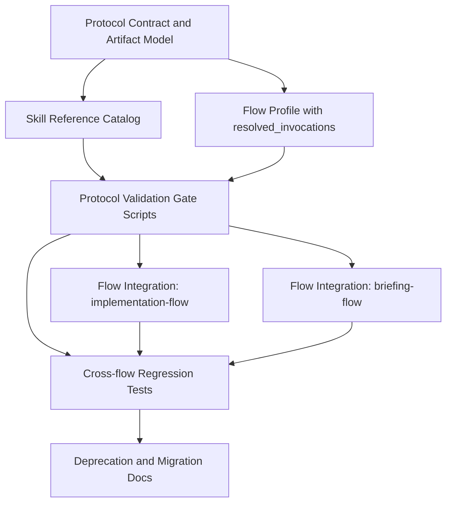

# Implementation Plan: skill-discovery-protocol 汎用化とフロー置換

## Overview

`implementation-flow` と `briefing-flow` が個別に持つ discovery protocol を、
再利用可能な単独スキル `skill-discovery-protocol` として再定義する。

この計画のゴールは次の 5 点。

1. プロトコル定義を flow 固有記述から分離し、他スキルでも流用できる共通仕様にする。
2. 生成・更新・検証をすべてスクリプト経由に統一し、手作業差分を排除する。
3. フォーマットの厳格性、再現性、冪等性をゲートで担保する。
4. `implementation-flow` と `briefing-flow` を段階的に置換して運用を切り替える。
5. 2 層モデル（Skill Reference Catalog / Flow Profile）を採用し、override 解決結果は Flow Profile（`*-profile.json`）の `resolved_invocations` に保持する。

## Existing Spec / Equivalent Sources Read

- `packages/doc-driven-dev-apm/.apm/skills/implementation-flow/SKILL.md`
- `packages/doc-driven-dev-apm/.apm/skills/implementation-flow/references/skill-discovery-protocol.md`
- `packages/doc-driven-dev-apm/.apm/skills/implementation-flow/references/implementation-profile-schema.md`
- `packages/doc-driven-dev-apm/.apm/skills/implementation-flow/assets/templates/implementation-profile-template.md`
- `packages/doc-driven-dev-apm/.apm/skills/briefing-flow/SKILL.md`
- `packages/doc-driven-dev-apm/.apm/skills/briefing-flow/references/briefing-discovery-protocol.md`
- `packages/doc-driven-dev-apm/.apm/skills/briefing-flow/references/briefing-profile-schema.md`
- `packages/doc-driven-dev-apm/.apm/skills/briefing-flow/assets/templates/briefing-profile-template.md`
- `packages/doc-driven-dev-apm/tests/doc-suite.test.ts`
- `packages/doc-driven-dev-apm/scripts/build-skill-scripts.ts`

## Two-layer Model



依存の要点:

- 先に共通契約を固定しないと、フロー側置換時に仕様差分が発散する。
- 生成スクリプトと検証ゲートは同時設計が必要。生成だけ先行すると再現性を担保できない。
- フロー置換は独立に進められるが、最終完了判定は両方のゲート通過が必須。

## Architecture Decisions

- AD-1: `skill-discovery-protocol` は新規スキルとして実装し、flow の references には内蔵しない。
- AD-2: profile 成果物（`implementation-profile.md` / `briefing-profile.md` 等）の更新は常に専用スクリプトのみ許可。
- AD-3: 冪等性ゲートを必須化する（同一入力で 2 回実行して差分 0 を確認）。
- AD-4: 既存プロトコルの文言・分類をそのまま移植しない。汎用契約を先に定義し、flow 依存は adapter 層に閉じ込める。
- AD-5: 検証は `schema gate + staleness gate + deterministic render gate` の 3 層で行う。
- AD-6: プロトコル標準成果物（Skill Reference Catalog）は機械可読（JSON）と人間可読（Markdown）の二重出力にする。
- AD-7: Skill Reference Catalog には、各スキルが呼び出す可能性のあるスキル/能力と能力スロット定義を統合して列挙する。
- AD-8: adapter 設定形式は YAML に統一する。
- AD-9: 旧 protocol 文書は即時 deprecated とし、移行導線のみ残す。
- AD-10: override 解決結果は Flow Profile（`*-profile.json`）の `resolved_invocations` に保持する。
- AD-11: Skill Reference Catalog の slot 定義は具体スキル名を持たず、`adr_authoring` `code_review` `specification` など能力スロットで定義し、識別子は `snake_case` に固定する。
- AD-12: 生成時点から Flow Profile（`*-profile.json`）を正とし、catalog・分類・解決結果・実行時ガイダンスを単一 JSON に出力する。
- AD-13: `sdp query --profile <file>` コマンド群を提供し、カテゴリ/スキル/解決結果/実行時ガイダンスを必要最小限で抽出できるようにする。
- AD-14: `sdp` は用途/責務でコマンド面を分離し、生成・更新は `sdp generate ...`、検証は `sdp validate ...`、参照抽出は `sdp query ...` に統一する。
- AD-15: 旧 default stack は `flow_stack.slots[]` に汎用化して統合し、slot ごとに `slot_type`（`layerable|exclusive`）、`activation`（`always|conditional|on_demand|gate`）、`default` を定義できるようにする。
- AD-16: Skill Reference Catalog 側に `execution_policy` を持たせ、`strictness`（`rigid|flexible`）、`sequence_required`、`allow_step_reordering`、`allow_partial_application`、`guidance` を標準化する。

## Adapter YAML Schema

Flow Profile 生成時に参照する adapter 設定 YAML のスキーマを次で固定する。

必須キー:

- `schema_version` / `adapter_id`: adapter 識別情報
- `protocol`: 対象 protocol 互換性情報（name/min_version）
- `scan`: 有効スコープ定義（project/user/organization/builtin）
- `profile`: flow 用 profile artifact 出力設定
- `flow_stack`: flow が使うスタックのスロット定義
- `classification`: flow 固有分類 taxonomy 定義
- `invocation_resolution`: 親フローによる解決設定（出力先/override/解決順序/異常時ポリシー）
- `validation`: schema / staleness / deterministic / invocation の gate 設定
- `render`: 再現性出力制御（sort / normalize / newline など）
- `artifacts`: 検証・生成成果物の出力先
- `invocation_resolution.overrides.slots` と `invocation_resolution.overrides.capabilities` のキーは `snake_case` に固定

`classification` ルール:

- `classification.taxonomy` を正規形式とする（`vocab` は使わない）。
- 各 taxonomy 要素は `id` `label` `description` `match` を持つ。
- `match` はオブジェクト形式とし、`capabilities[]` `tags[]` `description_patterns[]` を必須で持つ。
- `description_patterns[]` は正規表現または部分一致パターン文字列の配列とする。
- `classification.unmatched` を必須とし、`action` `severity` を持つ。
- `classification.unmatched.action` は `assign|warn|fail|ignore` のいずれかとする。
- `classification.unmatched.category` は `action = assign` の場合に必須とし、taxonomy の `id` と一致しなければならない。
- `classification.unmatched.severity` は `info|warn|error` のいずれかとする。

`invocation_resolution` ルール:

- `output_json` と `output_md` を必須とし、解決結果の出力先を指定する。
- `overrides.slots.<slot_name>` は `use` `reason` `fallback` を持つ。
- `overrides.capabilities.<capability_name>` は `prefer` `fallback` `reason` を持つ。
- `overrides.slots` のキーは Skill Reference Catalog の `slot_id` と一致し、`snake_case` に固定する。
- `overrides.capabilities` のキーは capability 識別子と一致し、`snake_case` に固定する。
- `resolution_order` は `slot_override` `capability_override` `default_skill` `provider_lookup` から選び、重複なしで優先順を定義する。
- `unresolved.required` は `fail|warn`、`unresolved.optional` は `warn|ignore` を許可する。
- `invalid_override.unknown_skill` `invalid_override.capability_mismatch` `invalid_override.override_not_allowed` は `fail|warn` を許可する。

`scan` ルール:

- スコープは `project` `user` `organization` `builtin` の 4 種を扱う。
- `scan.scopes.<scope_name>` は `enabled` と `roots` を持つ。
- `roots` は各スコープで有効な探索起点パス配列とする。
- `general-adapter` に全主要ハーネス向けの `roots` を集約定義する。
- flow 固有 adapter は `extends: "general-adapter"` を使って必要な差分のみ上書きする。
- 既定値は `project.enabled = true`、その他スコープは `enabled = false` とする。
- マージ後に `enabled = true` のスコープは `roots` 非空を必須とし、欠落は schema error とする。

`flow_stack` ルール:

- `flow_stack.slots` は配列必須とし、各要素は `slot_id` `slot_type` `activation` を必須とする。
- `slot_id` は `snake_case` とし、Skill Reference Catalog の slot 定義と一致しなければならない。
- `slot_type` は `layerable|exclusive` のいずれかとする。
- `activation` は `always|conditional|on_demand|gate` のいずれかとする。
- `default` は任意とし、既定割り当ての skill もしくは capability を指定できる。
- `default.reason` は推奨とし、既定割り当ての根拠を記録する。
- `sdp query` で `flow_stack` を抽出できる形式で出力に保持する。

追加推奨キー（不足補完）:

- `extends`: general adapter を継承するための参照
- `enabled`: adapter の有効/無効切替
- `priority`: 複数 override 競合時の優先順位
- `metadata`: owner / last_validated_at / description など運用メタ情報

`extends` 解決ルール:

- adapter YAML にパス文字列は書かない。
- `extends` は参照名指定（拡張子なし）で記述する。
- 解決先は `skill-discovery-protocol/references/` 配下に固定し、`{name}.yaml` と `{name}.yml` をこの順で探索する。
- 両方存在する場合は `.yaml` を優先し、複数一致は schema error とする。
- `extends` は入れ子を許可し、親がさらに `extends` を持つ場合は最上位まで再帰的に解決する。
- マージ適用順は「最上位親 -> ... -> 直接親 -> 子 adapter」で固定する。
- 循環参照（例: `a -> b -> a`）を検出した場合は schema error とし、処理を中断する。
- マージ規則は「オブジェクトは再帰マージ（後勝ち）」「スカラーは後勝ち上書き」「配列は子側で置換」を既定とする。
- `scan.scopes` の `enabled = true` かつ `roots` 非空チェックを含む schema 検証は、全 `extends` マージ後の最終結果に対して実行する。

最小例:

```yaml
schema_version: "1.0"
adapter_id: "briefing-flow-default"

protocol:
  name: "skill-discovery-protocol"
  min_version: "1.0"

scan:
  scopes:
    project:
      enabled: true
      roots:
        - ".apm/skills"
        - ".apm/skills/*/references"
    user:
      enabled: false
      roots:
        - "${COPILOT_USER_SKILLS}"
    organization:
      enabled: false
      roots:
        - "${COPILOT_ORG_SKILLS}"
    builtin:
      enabled: false
      roots:
        - "${COPILOT_BUILTIN_SKILLS}"

profile:
  output_path: "tasks/briefing-profile.md"
  template: ".apm/skills/briefing-flow/assets/templates/briefing-profile-template.md"

flow_stack:
  slots:
    - slot_id: "adr_authoring"
      slot_type: "exclusive"
      activation: "on_demand"
      default:
        skill: "documentation-and-adrs"
        reason: "ADR authoring tasks need architecture-focused output"
    - slot_id: "code_review"
      slot_type: "layerable"
      activation: "gate"
      default:
        skill: "code-review-and-quality"
        reason: "Quality gate requires dedicated reviewer skill"

classification:
  unmatched:
    action: "assign"
    category: "uncategorized"
    severity: "warn"
  taxonomy:
    - id: "uncategorized"
      label: "Uncategorized"
      description: "Fallback category when no taxonomy rule matches"
      match:
        capabilities: []
        tags: []
        description_patterns: []
    - id: "implementation"
      label: "Implementation"
      description: "Implementation and delivery related work"
      match:
        capabilities:
          - "coding"
          - "delivery"
        tags:
          - "implementation"
        description_patterns:
          - "implement"
          - "delivery"
    - id: "architecture"
      label: "Architecture"
      description: "Architecture and ADR related work"
      match:
        capabilities:
          - "adr-authoring"
        tags:
          - "architecture"
          - "design"
        description_patterns:
          - "adr"
          - "architecture"
    - id: "quality"
      label: "Quality"
      description: "Quality activities such as review and test"
      match:
        capabilities:
          - "code-review"
          - "testing"
        tags:
          - "quality"
          - "qa"
        description_patterns:
          - "review"
          - "test"

invocation_resolution:
  output_json: "tasks/invocation-resolution.json"
  output_md: "tasks/invocation-resolution.md"
  overrides:
    slots:
      adr_authoring:
        use: "documentation-and-adrs"
        reason: "ADR authoring tasks require architecture-focused output"
        fallback: null
      code_review:
        use: "code-review-and-quality"
        reason: "Primary reviewer skill for code quality checks"
        fallback: "documentation-and-adrs"
    capabilities:
      adr_authoring:
        prefer: "documentation-and-adrs"
        fallback: null
        reason: "Prefer ADR specialist when capability is requested"
      code_review:
        prefer: "code-review-and-quality"
        fallback: null
        reason: "Prefer dedicated review skill for review capability"
  resolution_order:
    - "slot_override"
    - "capability_override"
    - "default_skill"
    - "provider_lookup"
  unresolved:
    required: "fail"
    optional: "warn"
  invalid_override:
    unknown_skill: "fail"
    capability_mismatch: "warn"
    override_not_allowed: "warn"

validation:
  schema: true
  staleness:
    enabled: true
    basis: "validated_at"
    max_age_days: 30
  deterministic:
    enabled: true
    compare:
      - "profile"
      - "profile+catalog-artifacts"
      - "validation-report:exclude-timestamp"

render:
  stable_sort:
    skills:
      - "name"
    invocations:
      - "source_skill"
      - "slot"
      - "capability"
  normalize_whitespace: true
  newline: "lf"

artifacts:
  protocol:
    skill_reference_catalog_md: "tasks/skill-reference-catalog.md"
    skill_reference_catalog_json: "tasks/skill-reference-catalog.json"
    flow_profile_json: "tasks/briefing-profile.json"
    validation_report_json: "tasks/validation-report.json"

extends: "general-adapter"
enabled: true
priority: 100
metadata:
  owner: "briefing-flow"
  last_validated_at: "2026-05-28T00:00:00Z"
  description: "default adapter for briefing flow"
```

## Two-layer Artifact Format

`skill-discovery-protocol` の標準成果物を以下に定義する。

1. `skill-reference-catalog.md` / `skill-reference-catalog.json`
- 各スキルが呼び出し可能な「スキル名」または「能力」を列挙
- `adr_authoring` `code_review` `specification` など能力スロット定義を同一成果物に統合
- 各スキルに `execution_policy`（strictness/sequence_required/allow_step_reordering/allow_partial_application/guidance）を保持
- スキル単位で outbound reference を安定ソートで出力

2. `*-profile.json`（Flow Profile）
- Skill Reference Catalog、分類結果、解決結果（`resolved_invocations`）、実行時ガイダンスを単一 JSON として出力
- `flow_stack.slots[]`（slot_type/activation/default を含む）を保持し、旧 default stack を置換
- `sdp generate` が生成・更新し、`sdp query` が機械抽出に利用する

3. `validation-report.json`（必要に応じて `.md` も生成）
- 生成時刻、対象リポジトリ、使用 adapter（YAML）
- schema 検証結果（pass/fail、失敗項目一覧）
- staleness 検証結果（新規/欠落スキル、`validated_at` 基準日）
- deterministic 検証結果（以下比較での再実行差分有無）
  - Flow Profile の比較
  - Flow Profile + catalog artifacts の比較
  - validation-report のタイムスタンプ項目除外比較
- Skill Reference Catalog 検証結果（skill_count、reference_count、capability_count、slot_count、孤立 skill、未解決 slot 一覧）
- Flow Profile 解決結果参照（flow_count、resolved_invocation_count、未使用 override 警告数）
- 総合結果（pass/fail）

`sdp` コマンド責務:

- `sdp generate --adapter <adapter-yaml> ...`: adapter 設定を入力に profile / catalog / report の生成・更新を行う。
- `sdp validate ...`: profile / catalog / report の検証を行う。
- `sdp query ...`: `*-profile.json` から用途別に情報を抽出する。

注記:

- `sdp` のコマンド/サブコマンドは将来要件に応じて拡張可能とする。
- 以下の `sdp query` サブコマンド定義は現時点の最小提案セットであり、固定仕様ではない。

例:

- `sdp generate --adapter .apm/skills/briefing-flow/references/briefing-adapter.yaml`
- `sdp validate --profile tasks/briefing-profile.json`
- `sdp query --profile tasks/briefing-profile.json categories`

`sdp query` サブコマンド最小セット（現時点の提案）:

- `categories`: カテゴリ一覧（カテゴリ名、要約、選択ヒント、備考）
- `category-skills --category <id>`: 該当カテゴリのスキル一覧（スキル名、提供機能、選択ヒント、備考）
- `resolution [--skill <name>]`: スキル解決関係（依存能力、解決済み呼び出し、実行時ガイダンス）
- `flow-stack [--slot <id>]`: Flow Stack 定義（slot_type/activation/default）
- `execution-policy [--skill <name>]`: 実行ポリシー抽出（strictness/sequence/guidance）
- `capability-skills --capability <id>`: capability 逆引き
- `skill-detail --skill <name>`: スキル詳細
- `runtime-guidance [--skill <name>]`: 実行時ガイダンス抽出
- `unresolved`: 未解決 slot/capability 一覧
- `validation-status`: schema/staleness/deterministic/overall の要約

補足:

- プロトコル `validation-report` には Skill Reference Catalog の検証結果を含める。
- override 解決の検証結果は `*-profile.json` と `validation-report` に記録し、未使用 slot/override は警告扱いとする。
- fail 条件は schema/staleness/deterministic の不一致に限定する。
- `overall_result` は次式で固定する: `schema && staleness && deterministic`。
- `*-profile.json` は deterministic 比較対象に含め、同一入力で安定出力されることを保証する。

## Task List

### Phase 1: Foundation

## Task 1: 共通 discovery 契約を定義する

**Description:**
`skill-discovery-protocol` が扱う入力（scan source, classification policy, activation policy）と
出力（profile artifact, validation report）の共通契約を定義する。flow 固有のカテゴリ語彙は
拡張ポイントとして分離し、プロトコル本体は中立化する。

**Acceptance criteria:**
- [ ] プロトコルの canonical steps（scan/classify/activate/execution-mode/default-stack/render/validate）が定義される。
- [ ] scan スキーマで project/user/organization/builtin の複数スコープを扱える。
- [ ] 既定設定が `project` のみ有効であることが明文化される。
- [ ] `scan.scopes.<scope>.enabled/roots` の契約が定義され、`general-adapter` に全主要ハーネスの roots を集約している。
- [ ] flow 固有カテゴリを taxonomy + `classification.unmatched` として差し替え可能な設定モデルが定義される。
- [ ] 生成物と検証レポートのフォーマットが明文化される。

**Verification:**
- [ ] 規約文書レビューで `implementation-flow` 依存語が本体契約に残っていないことを確認。
- [ ] `pnpm run lint:md` が通る。

**Dependencies:** None

**Files likely touched:**
- `.apm/skills/skill-discovery-protocol/SKILL.md`
- `.apm/skills/skill-discovery-protocol/SKILL.ja.md`
- `.apm/skills/skill-discovery-protocol/references/protocol-contract.md`
- `.apm/skills/skill-discovery-protocol/references/protocol-contract.ja.md`

**Estimated scope:** Medium

## Task 2: スクリプト駆動の成果物操作ルールを定義する

**Description:**
成果物の作成・更新・再検証を手動編集禁止にし、必ず script command を経由させる運用規約と
ゲート条件を定義する。合わせて build 経路（`src/skills/**/scripts/*.ts` → `.apm/skills/**/scripts/*.js`）との
整合を設計する。

**Acceptance criteria:**
- [ ] 「成果物操作は script only」の規約が英日で記載される。
- [ ] 生成スクリプト、更新スクリプト、検証スクリプトの責務分離が定義される。
- [ ] ゲート失敗時の終了コードとエラーメッセージ方針が定義される。
- [ ] adapter YAML スキーマ（必須キー群 + 追加推奨キー）が定義される。
- [ ] adapter YAML の `flow_stack.slots[]` スキーマ（slot_type/activation/default）が定義される。
- [ ] `invocation_resolution` は Flow Profile の `resolved_invocations` 生成規約として明文化される。
- [ ] slot 識別子と mapping キーの命名規約が `snake_case` 固定で定義される。
- [ ] Skill Reference Catalog の `execution_policy`（strictness/sequence_required/allow_step_reordering/allow_partial_application/guidance）契約が定義される。
- [ ] `extends` はパス直書きを禁止し、参照名解決（`references/{name}.yaml|yml`）で定義される。
- [ ] `scan.scopes.<scope>.enabled/roots` を `general-adapter` 集約 + flow 差分上書きで解決する規約が定義される。
- [ ] `classification.taxonomy` と `classification.unmatched` の検証規約が定義される。
- [ ] script 経由操作の CLI 面を `sdp generate` / `sdp validate` / `sdp query` に分離する規約が定義される。

**Verification:**
- [ ] 規約文書に manual edit 禁止と例外条件が明記されている。
- [ ] `pnpm run lint:md` が通る。
- [ ] スキーマ不足キー時に schema gate が失敗することを fixture で確認する。
- [ ] 入れ子 `extends`（例: flow -> general -> minimal）を最上位から順に解決できることを fixture で確認する。
- [ ] `extends` 循環参照（例: `a -> b -> a`）が schema gate で失敗することを fixture で確認する。
- [ ] `scan.scopes` の `enabled=true` かつ `roots` 空が「全 extends マージ後の最終結果」で検出されることを fixture で確認する。

**Dependencies:** Task 1

**Files likely touched:**
- `.apm/skills/skill-discovery-protocol/references/operation-policy.md`
- `.apm/skills/skill-discovery-protocol/references/operation-policy.ja.md`
- `.apm/skills/skill-discovery-protocol/references/gate-spec.md`
- `.apm/skills/skill-discovery-protocol/references/gate-spec.ja.md`
- `.apm/skills/skill-discovery-protocol/references/general-adapter.yaml`

**Estimated scope:** Medium

### Checkpoint: Foundation

- [ ] プロトコル本体仕様が flow 非依存で定義されている。
- [ ] script-only 運用とゲート仕様が確定している。
- [ ] 人間レビューで「汎用化方針」に合意できる。

### Phase 2: Vertical Slices

## Task 3: Vertical Slice A - 共通生成パイプラインを実装する

**Description:**
`classify -> render` を一気通貫で実行し、対象プロファイルを出力する共通スクリプト群を実装する。
同一入力で安定ソート・安定レンダリングを保証し、冪等な成果物更新を実現する。

**Acceptance criteria:**
- [ ] adapter YAML を入力に共通生成コマンドで Flow Profile を新規生成できる。
- [ ] adapter YAML を入力に既存 Flow Profile の更新コマンドが動作する。
- [ ] `sdp generate --adapter <adapter-yaml>` で profile/catalog/report の生成・更新が実行できる。
- [ ] 同一入力で再実行したときファイル差分が発生しない。
- [ ] `skill-reference-catalog.md/.json` がプロトコル成果物として生成される。
- [ ] `*-profile.json`（Flow Profile）が生成され、`resolved_invocations` を保持する。
- [ ] `*-profile.json`（Flow Profile）が生成され、`flow_stack.slots[]` を保持する。
- [ ] Skill Reference Catalog に `execution_policy` が出力される。
- [ ] `sdp query --profile <file> categories|category-skills|resolution|flow-stack|execution-policy` が動作する。
- [ ] プロトコル成果物の並び順が安定し、再実行で順序差分が出ない。

**Verification:**
- [ ] `pnpm run build:scripts` 後に `.apm/skills/skill-discovery-protocol/scripts/*.js` が生成される。
- [ ] テストで 2 回連続実行して出力一致を確認。
- [ ] `pnpm test` が通る。
- [ ] 生成結果に Skill Reference Catalog と Flow Profile（`*-profile.json`）が含まれることをテストで確認。

**Dependencies:** Task 2

**Files likely touched:**
- `src/skills/skill-discovery-protocol/scripts/new_profile.ts`
- `src/skills/skill-discovery-protocol/scripts/update_profile.ts`
- `src/skills/skill-discovery-protocol/scripts/query_profile.ts`
- `src/skills/skill-discovery-protocol/scripts/lib/*.ts`
- `.apm/skills/skill-discovery-protocol/assets/templates/profile-template.md`
- `tests/doc-suite.test.ts`

**Estimated scope:** Medium

### Task 3A: Query サブコマンド拡張（実装タスク分解）

**Description:**
`sdp query` の拡張を安全に継続できるよう、サブコマンド実装をレジストリ駆動にし、
Flow Profile と Skill Reference Catalog の抽出ロジックを責務分離して実装する。

**Implementation tasks:**
- [ ] query エントリポイントにサブコマンドレジストリ（name -> handler）を導入する。
- [ ] 共通入力層として profile ローダーと schema 事前検証を実装する。
- [ ] 共通出力層として `json|md|table` のレンダラ抽象を実装する。
- [ ] 既存サブコマンド（`categories` / `category-skills` / `resolution`）をレジストリ構成へ移設する。
- [ ] 新規 `flow-stack` ハンドラを実装し、`--slot` フィルタをサポートする。
- [ ] 新規 `execution-policy` ハンドラを実装し、`--skill` フィルタをサポートする。
- [ ] `capability-skills` / `skill-detail` / `runtime-guidance` / `unresolved` / `validation-status` を共通フィルタ実装へ統合する。
- [ ] 未知サブコマンド時の終了コード/ヘルプ表示/候補提示のエラー規約を実装する。
- [ ] サブコマンド追加時に 1 ファイル追加で拡張できる開発規約を docs に明記する。

**Acceptance criteria:**
- [ ] `sdp query` がレジストリ駆動で動作し、既存サブコマンドの挙動を維持する。
- [ ] `flow-stack` / `execution-policy` が Flow Profile から抽出できる。
- [ ] サブコマンド追加時に既存ハンドラ修正なしで拡張できる。
- [ ] サブコマンド仕様が「最小提案セット」であり将来拡張可能である旨が文書化される。

**Verification:**
- [ ] 既存サブコマンド回帰テスト（正常/該当なし/入力不正）が pass。
- [ ] `flow-stack --slot` と `execution-policy --skill` のフィルタテストが pass。
- [ ] 未知サブコマンド時に非 0 終了 + ヘルプ表示となることをテストで確認。
- [ ] サブコマンド追加テンプレートに従った最小追加（ダミー）で拡張性テストが pass。

**Dependencies:** Task 3

**Files likely touched:**
- `src/skills/skill-discovery-protocol/scripts/query_profile.ts`
- `src/skills/skill-discovery-protocol/scripts/lib/query/*.ts`
- `src/skills/skill-discovery-protocol/scripts/lib/render/*.ts`
- `tests/skills/skill-discovery-protocol/query/*.test.ts`
- `.apm/skills/skill-discovery-protocol/references/operation-policy.md`

**Estimated scope:** Medium

## Task 4: Vertical Slice B - 再現性と厳格性のゲートを実装する

**Description:**
schema 検証、staleness 検証、deterministic 検証（再実行差分ゼロ）を行うゲートスクリプトを実装し、
プロトコル運用の品質下限を自動で強制する。

**Acceptance criteria:**
- [ ] `sdp validate` コマンドで schema 違反を検出できる。
- [ ] stale チェックで `validated_at` 基準の 30 日超過・スキル増減を検出できる。
- [ ] deterministic チェックで順序ゆらぎと不安定レンダリングを検出できる。
- [ ] validate コマンドで Skill Reference Catalog の整合性を検証できる。
- [ ] `resolved_invocations` の検証を `sdp validate` で行い、未使用または未解決 slot は警告として記録される。
- [ ] `validation-report` に schema/staleness/deterministic/skill-reference-catalog の結果が出力される。
- [ ] `overall_result` が `schema && staleness && deterministic` で算出される。
- [ ] `*-profile.json` の schema と query 応答形式を validate コマンドで検証できる。
- [ ] `flow_stack.slots[]` と `execution_policy` の schema を validate コマンドで検証できる。

**Verification:**
- [ ] 異常 fixture を使った失敗ケースがテスト化される。
- [ ] 正常ケースで gate コマンドが 0 終了する。
- [ ] `sdp validate` 正常ケースで終了コード 0、検証失敗時は非 0 になる。
- [ ] `pnpm test` が通る。
- [ ] override 有/無の両 fixture で Flow Profile の `resolved_invocations` フォーマットを検証するテストが pass。
- [ ] 未使用 slot fixture で「Flow Profile と validation-report に警告記録されるが停止しない」ことをテストで確認する。
- [ ] 入れ子 `extends` のマージ規則（object 再帰/ scalar 後勝ち/ array 置換）が期待どおり適用されることを fixture で確認する。
- [ ] `extends` の解決順（最上位親 -> ... -> 直接親 -> 子 adapter）どおりに最終設定が決定されることをテストで確認する。
- [ ] `sdp query` の主要サブコマンド（`categories` / `category-skills` / `resolution` / `flow-stack` / `execution-policy`）が Flow Profile を正しく抽出することをテストで確認する。

**Dependencies:** Task 3, Task 3A

**Files likely touched:**
- `src/skills/skill-discovery-protocol/scripts/validate_profile.ts`
- `src/skills/skill-discovery-protocol/scripts/check_staleness.ts`
- `src/skills/skill-discovery-protocol/scripts/check_idempotency.ts`
- `.apm/skills/skill-discovery-protocol/references/profile-schema.md`
- `tests/doc-suite.test.ts`

**Estimated scope:** Medium

## Task 5: Vertical Slice C - implementation-flow を新プロトコルに置換する

**Description:**
`implementation-flow` の discovery 記述を新スキル呼び出しに置換し、
profile 生成/更新/検証を共通スクリプト経由に統一する。既存 completion 条件と hard-gate は維持する。

**Acceptance criteria:**
- [ ] `implementation-flow` が内蔵 protocol ではなく `skill-discovery-protocol` を参照する。
- [ ] `implementation-profile.md` の生成・更新・検証手順が script command に置き換わる。
- [ ] 旧 protocol 参照を即時削除し、互換モードを設けない。

**Verification:**
- [ ] 置換後に `implementation-profile` 生成テストが pass。
- [ ] 既存 `implementation-flow` 関連テストが回帰しない。
- [ ] `pnpm test` が通る。

**Dependencies:** Task 4

**Files likely touched:**
- `.apm/skills/implementation-flow/SKILL.md`
- `.apm/skills/implementation-flow/SKILL.ja.md`
- `.apm/skills/implementation-flow/references/skill-discovery-protocol.md`
- `.apm/skills/implementation-flow/references/skill-discovery-protocol.ja.md`
- `tests/doc-suite.test.ts`

**Estimated scope:** Medium

## Task 6: Vertical Slice D - briefing-flow を新プロトコルに置換する

**Description:**
`briefing-flow` でも同様に discovery 記述を共通プロトコル参照へ移行し、
`briefing-profile.md` のライフサイクルを script + gate で管理する。

**Acceptance criteria:**
- [ ] `briefing-flow` が `briefing-discovery-protocol` 内蔵運用から共通運用へ切り替わる。
- [ ] `briefing-profile.md` の操作が script-only で定義される。
- [ ] Entry Decision による上位ロジックは保持される。

**Verification:**
- [ ] 置換後に `briefing-profile` 生成/検証テストが pass。
- [ ] `briefing-flow` completion gate の要件が維持される。
- [ ] `pnpm test` が通る。

**Dependencies:** Task 4

**Files likely touched:**
- `.apm/skills/briefing-flow/SKILL.md`
- `.apm/skills/briefing-flow/SKILL.ja.md`
- `.apm/skills/briefing-flow/references/briefing-discovery-protocol.md`
- `.apm/skills/briefing-flow/references/briefing-discovery-protocol.ja.md`
- `tests/doc-suite.test.ts`

**Estimated scope:** Medium

### Checkpoint: Replacement Complete

- [ ] implementation-flow / briefing-flow の両方が共通プロトコルを利用している。
- [ ] profile 成果物更新が script-only で統一されている。
- [ ] ゲート未通過時に flow が進行しないことを確認できる。
- [ ] 2 層成果物（Skill Reference Catalog / Flow Profile）が両 flow で再現可能に出力される。

### Phase 3: Hardening and Rollout

## Task 7: 回帰テストと CI 相当の検証導線を整備する

**Description:**
共通プロトコル導入後の回帰を防ぐため、生成・更新・検証・置換後フローの統合テストを追加し、
通常コマンドで再現できる検証導線を確立する。

**Acceptance criteria:**
- [ ] プロトコル関連の正常系/異常系テストが追加される。
- [ ] 2 つの flow 置換後シナリオをテストで再現できる。
- [ ] ドキュメント lint と script build を含む検証手順が記録される。
- [ ] `sdp query` の CLI 回帰テスト（正常系/該当なし/入力不正）が追加される。
- [ ] query サブコマンド拡張手順（レジストリ追加/handler 追加/テスト追加）がドキュメント化される。

**Verification:**
- [ ] `pnpm run build:scripts` が通る。
- [ ] `pnpm test` が通る。
- [ ] `pnpm run lint:md` が通る。

**Dependencies:** Task 5, Task 6

**Files likely touched:**
- `tests/skills/skill-discovery-protocol/*.test.ts`
- `package.json`
- `README.md`
- `README.ja.md`

**Estimated scope:** Medium

## Task 8: 旧プロトコルの整理と移行ガイドを提供する

**Description:**
旧 protocol 文書を deprecated 扱いにし、共通プロトコルへの移行方針・互換運用・将来拡張方法を記述する。
他スキルが再利用しやすい導入テンプレートも追加する。

**Acceptance criteria:**
- [ ] 旧 protocol の位置づけが「即時 deprecated」で明記される。
- [ ] 新規スキルが共通プロトコルを採用する手順が記載される。
- [ ] 英日ドキュメントの記述が整合する。

**Verification:**
- [ ] 移行ガイドのコマンド例が script-only で統一されている。
- [ ] `pnpm run lint:md` が通る。

**Dependencies:** Task 7

**Files likely touched:**
- `README.md`
- `README.ja.md`
- `.apm/skills/implementation-flow/references/skill-discovery-protocol.md`
- `.apm/skills/briefing-flow/references/briefing-discovery-protocol.md`
- `.apm/skills/skill-discovery-protocol/docs/migration.md`

**Estimated scope:** Small

### Checkpoint: Release Readiness

- [ ] `pnpm run build:scripts` 実行済み。
- [ ] `pnpm test` 全 pass。
- [ ] `pnpm run lint:md` 全 pass。
- [ ] `implementation-flow` と `briefing-flow` の置換完了を人間レビューで承認。

## Risks and Mitigations

| Risk | Impact | Mitigation |
| --- | --- | --- |
| flow ごとの差異を吸収できず共通化が形骸化する | High | プロトコル本体は抽象契約のみ、flow 固有差分は adapter 設定に限定する。 |
| 冪等性が崩れ差分ノイズが発生する | High | deterministic gate を必須化し、安定ソートと固定レンダリングを強制する。 |
| 手動編集が混入して再現不能になる | High | script-only 規約 + gate failure code でブロックする。 |
| 既存 flow との互換性が壊れる | Medium | 置換を flow 単位で段階実施し、各段階で回帰テストを必須化する。 |
| 英日文書の差分が乖離する | Medium | 同一タスクで英日同時更新し、lint とレビューで照合する。 |

## Decisions from Human Review

- 共通プロトコル成果物は `skill-reference-catalog + *-profile.json + validation-report` を採用する。
- 旧 protocol 文書は即時 deprecated とする。
- adapter 設定形式は YAML に統一する。
- adapter YAML は general のみ `skill-discovery-protocol` 配下に置き、flow 固有設定は各 flow の references 配下のパス入力を受けて読み込む。
- Skill Reference Catalog は「呼び出す可能性のあるスキル/能力」と能力スロット定義を統合して列挙する。
- 旧 default stack は `flow_stack.slots[]`（slot_type/activation/default）として Flow Profile に統合する。
- Skill Reference Catalog は各スキルに `execution_policy`（strictness/sequence_required/allow_step_reordering/allow_partial_application/guidance）を保持する。
- override 解決結果は `*-profile.json` の `resolved_invocations` に統合して扱う。
- override 検証は `sdp validate` で実施し、結果は `validation-report` に記録する。
- staleness は `validated_at` を基準日として評価する。
- deterministic gate は「Flow Profile」「Flow Profile + catalog artifacts」「validation-report のタイムスタンプ項目除外」で比較する。
- fail 条件は `schema/staleness/deterministic` のみで固定し、`overall_result = schema && staleness && deterministic` とする。
- 置換時の互換モードは設けず、旧 protocol 参照は即時削除する。
- テストは skill 単位で新規ファイルを分けて管理する。

## Human Review Request

この計画は実装前レビュー用です。特に次を確認してください。

1. `skill-discovery-protocol` を単独スキル化する分離方針の妥当性
2. script-only 運用と 3 層ゲート（schema/staleness/deterministic）の強制レベル
3. `implementation-flow` と `briefing-flow` を並行ではなく段階置換する順序の妥当性
4. 2 層成果物（Skill Reference Catalog / Flow Profile）と validation-report 項目定義の妥当性

