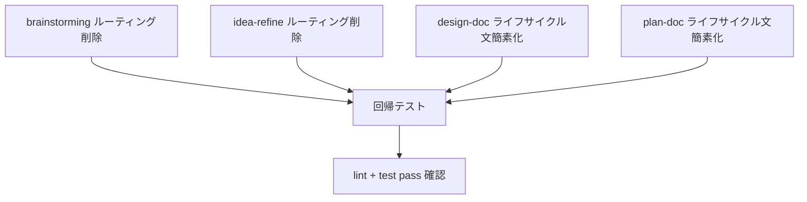

# Plan: 既存スキルのオーケストレーション責務削減

## Overview

`doc-driven-dev-flow` メタスキルの導入により、ライフサイクル全体の
シーケンシング（順序制御）とルーティング（分岐判定）はメタスキルが担う
ようになった。

本計画の目的は、既存の各スキルに残る「ライフサイクル順序の説明」
「下流スキルへのルーティング指示」「フェーズ飛ばし防止の警告」のうち、
メタスキルと重複するものを削除・簡素化し、各スキルの責務を
「自身のアーティファクト生成」に集中させることである。

### 原則

- **削除対象**: ライフサイクル全体の順序図、下流ルーティング判定ロジック、
  フェーズ飛ばし警告のうちメタスキルに移動済みのもの。
- **残す対象**: 自スキル内で完結する hard gate（例: plan-doc スクリプトの
  PLAN-DOC-GATE-001 エラーメッセージ）、自スキルの artifact テンプレート内の
  ルーティングチェックリスト（成果物の一部として有用）。
- **追加対象**: 削除箇所に代わる 1〜2 行の参照リンク
  （「全体フローは `doc-driven-dev-flow` を参照」）。

## Dependency Graph



依存の要点:

- 4 スキルの変更は相互独立。並列実行可能。
- 全変更後に回帰テスト（`pnpm test` + `pnpm run lint:md`）を通す。
- `task-doc` と `doc-status` は変更不要（ルーティング責務を持たない）。

## Investigation Results

### brainstorming (SKILL.md / SKILL.ja.md)

**重複箇所（削除対象）:**

1. **Checklist #9**（約 L50）:
   > "Transition to downstream documents using the dual-track model:
   > spec-doc + adr-doc (parallel) when both product requirements and technical
   > decisions are clear. Then design-doc, then plan-doc, then task-doc."

2. **Process Flow diagram terminal state**（約 L70-90）:
   > `"Route to spec-doc / adr-doc / design-doc / plan-doc / task-doc"` ノードと
   > 直後の説明文（"The terminal state is routing..." ～ "task-doc: only when..."）

3. **ライフサイクル全体文**（約 L107）:
   > "The dual-track: **brainstorming → spec + ADR (parallel) → design → plan → task**."

**残す対象:**
- Discovery artifact テンプレート内の "Document Routing" セクション（成果物の一部）。
- Discovery self-review の "Routing check" 項目（成果物品質チェック）。
- "Implementation" セクションの「brainstorming から直接実装しない」指示。

---

### idea-refine (SKILL.md / SKILL.ja.md)

**重複箇所（削除対象）:**

1. **「仕組み」セクション Step 3 の routing 言及**（約 L21-24）:
   > "route into `brainstorming` or directly into `spec-doc` + `adr-doc`"

2. **テンプレート内 "Suggested Document Routing" セクション**（約 L238-243）:
   > ```
   > - [ ] Move to `brainstorming`
   > - [ ] ADR likely needed
   > - [ ] Spec likely needed
   > - [ ] Plan/task likely ready
   > ```

3. **Anti-Patterns 内 "Don't jump phases" 警告**（約 L278）:
   > "Do not jump directly to ADR, spec, plan, task, or implementation before
   > the idea is refined enough to route."

4. **Verification 最終項目**（約 L305）:
   > "The next document route is explicit: `brainstorming`, ADR, spec, plan, task, or parked."

**残す対象:**
- Phase 1/2/3 のアイデア精製プロセス自体。
- "Not Doing" リスト、assumptions 表面化。
- artifact テンプレートの他セクション（Raw Idea, Problem Statement, etc.）。

---

### design-doc (SKILL.md / SKILL.ja.md)

**重複箇所（簡素化対象）:**

1. **ライフサイクル全文**（約 L11-13）:
   > "The package lifecycle is:
   > **spec + ADR (parallel) -> design -> plan -> task**.
   > `design-doc` is a hard gate for `plan-doc`..."

**対処:** ライフサイクル全体の記述を削除し、1 行参照に置換。
   gate 自体は `plan-doc` スクリプト側で強制されるため `design-doc` 側での
   再説明は不要。

**残す対象:**
- overview-first 構造、テンプレート、front matter、ディレクトリ契約。

---

### plan-doc (SKILL.md / SKILL.ja.md)

**重複箇所（簡素化対象）:**

1. **ライフサイクル全文**（約 L11-14）:
   > "In this package's lifecycle, the upstream path is:
   > **spec + ADR (parallel) → design → plan**.
   > `design-doc` is a hard gate for `plan-doc`."

**対処:** ライフサイクル全体の記述を削除し、1 行参照に置換。
   gate 強制はスクリプト側に残す（PLAN-DOC-GATE-001 メッセージは保持）。

**残す対象:**
- Workflow ステップ（上流読み、design gate 確認、ADR 確認、plan 作成）。
- Implementation Readiness Matrix、Risk Register、Rollback Strategy。
- スクリプトエラーメッセージ（PLAN-DOC-GATE-001）。

---

### task-doc / doc-status — 変更不要

これらのスキルにはルーティング責務やライフサイクル全体の記述がなく、
自スキルのアーティファクト生成に集中している。変更不要。

Dependencies: Task 6

Files likely touched:
- `tests/doc-suite.test.ts`
- `.apm/skills/doc-driven-dev-flow/**`
- `tasks/plan.md`
- `tasks/todo.md`

Estimated scope: Small

### Checkpoint: Release Readiness

- [ ] `pnpm test` pass
- [ ] `pnpm run lint:md` pass
- [ ] `apm compile --dry-run` pass
- [ ] 人間レビューで計画と導線変更が承認済み

## Task List

### Phase 1: Parallel Simplification (independent edits)

#### Task 1: brainstorming — ルーティングセクション削除

Description:
Checklist #9 のルーティング指示、Process Flow 図の terminal ノード、
および直後の dual-track ルーティング説明を削除し、1 行参照に置換する。
英日両方の SKILL.md を対象とする。

Acceptance criteria:
- [ ] Checklist #9 が「Produce discovery artifact and await human review」相当に簡素化される。
- [ ] Process Flow 図の terminal state が「Human reviews artifact — done」で終わる。
- [ ] ルーティング説明（"The terminal state is routing..." ～ "task-doc: only when..."）が削除される。
- [ ] ライフサイクル全文（"The dual-track: brainstorming → ..."）が削除される。
- [ ] 代わりに「全体フローは `doc-driven-dev-flow` を参照」の 1 行が追加される。
- [ ] Discovery artifact テンプレート内の "Document Routing" チェックリストは残す。

Verification:
- [ ] `pnpm run lint:md` pass
- [ ] `pnpm test` pass（既存テストは成果物生成のみ検証のため影響なし）

Dependencies: None
Estimated scope: Small (2 files)

---

#### Task 2: idea-refine — ルーティング・フェーズ警告削除

Description:
「仕組み」セクション Step 3 のルーティング言及を簡素化し、
テンプレート内 "Suggested Document Routing" セクション、
Anti-Patterns 内のフェーズ飛ばし警告、Verification 末尾のルーティング確認を
削除または簡素化する。英日両方の SKILL.md を対象とする。

Acceptance criteria:
- [ ] Step 3 が「Produce a concrete Markdown one-pager for human review」相当に短縮される。
- [ ] テンプレートの "Suggested Document Routing" セクションが削除される。
- [ ] Anti-Patterns の "don't jump phases" 項目が削除される。
- [ ] Verification の最終項目（next document route）が削除される。
- [ ] 代わりに「全体フローは `doc-driven-dev-flow` を参照」の 1 行が追加される。

Verification:
- [ ] `pnpm run lint:md` pass
- [ ] `pnpm test` pass

Dependencies: None
Estimated scope: Small (2 files)

---

#### Task 3: design-doc — ライフサイクル文簡素化

Description:
SKILL.md / SKILL.ja.md 冒頭のライフサイクル全体記述とゲート説明を
1 行参照に簡素化する。

Acceptance criteria:
- [ ] "The package lifecycle is: **spec + ADR → design → plan → task**" が削除される。
- [ ] "`design-doc` is a hard gate for `plan-doc`" の文が削除される。
- [ ] 代わりに "For the full lifecycle flow, see `doc-driven-dev-flow`." が追加される。

Verification:
- [ ] `pnpm run lint:md` pass
- [ ] `pnpm test` pass

Dependencies: None
Estimated scope: XS (2 files)

---

#### Task 4: plan-doc — ライフサイクル文簡素化

Description:
SKILL.md / SKILL.ja.md 冒頭のライフサイクル全体記述を 1 行参照に簡素化する。
スクリプトの PLAN-DOC-GATE-001 エラーメッセージと Workflow ステップ内の
gate 確認手順は保持する。

Acceptance criteria:
- [ ] "the upstream path is: **spec + ADR → design → plan**" が削除される。
- [ ] "`design-doc` is a hard gate for `plan-doc`." 文がライフサイクル説明から削除される。
- [ ] Workflow ステップ 3 "Confirm design gate requirements" は保持される。
- [ ] 代わりに "For the full lifecycle flow, see `doc-driven-dev-flow`." が追加される。

Verification:
- [ ] `pnpm run lint:md` pass
- [ ] `pnpm test` pass（gate テストはスクリプト起点なので影響なし）

Dependencies: None
Estimated scope: XS (2 files)

### Checkpoint: After Phase 1

- [ ] `pnpm test` 全 pass（30 tests）
- [ ] `pnpm run lint:md` pass
- [ ] 各スキルが自身のアーティファクト生成に集中している状態
- [ ] 人間レビューで削除範囲が妥当か確認

### Phase 2: Verification and Rollout

#### Task 5: 回帰テストと整合確認

Description:
全変更後に `pnpm test`、`pnpm run lint:md`、`apm compile --dry-run` を実行し
回帰がないことを確認する。

Acceptance criteria:
- [ ] `pnpm test` pass
- [ ] `pnpm run lint:md` pass
- [ ] `apm compile --dry-run` pass

Dependencies: Task 1, 2, 3, 4
Estimated scope: XS

## Risks and Mitigations

| Risk | Impact | Mitigation |
| --- | --- | --- |
| 削除しすぎてスキル単体利用時に文脈不足 | Medium | 各スキルは単体でも使えるべき。ルーティング先の削除に留め、自スキル内ワークフローは保持する。 |
| Discovery テンプレートの routing チェックリスト削除で成果物品質が低下 | Medium | テンプレート内 routing は成果物の一部として残す。SKILL.md 側の説明のみ削除する。 |
| 英日の変更差分不整合 | Low | 同一タスクで英日同時変更。レビュー時に対訳確認する。 |
| メタスキルへの参照リンクが将来 rename で切れる | Low | スキル名ベースの参照（ファイルパスではなく名前）を使う。 |

## Open Questions for Human Review

- [ ] Discovery artifact テンプレート内の "Document Routing" チェックリストも
  削除すべきか（現計画では成果物の一部として残す方針）。
- [ ] 各スキルに追加する参照文（"see `doc-driven-dev-flow`"）の表現を
  英日でどう統一するか。
- [ ] `spec-doc` の軽微なライフサイクル言及（"dual-track: spec + ADR"）も
  削除すべきか、context として許容するか。

## Human Review Request

レビューで次の 3 点を確認してください:

1. 削除対象（上記 Investigation Results）の範囲は妥当か。
2. 残す対象（テンプレート routing、gate スクリプトメッセージ）は正しいか。
3. Task 1〜4 の粒度と並列実行可否は適切か。
