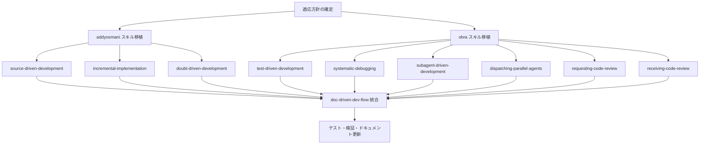

# Plan: 外部スキルのクローンと doc-driven-dev への統合

## Overview

`addyosmani/agent-skills` と `obra/superpowers` から実装フェーズ向けスキルをクローンし、
`doc-driven-dev-apm` パッケージに統合改変して取り込む。

### 取り込み対象

**From `addyosmani/agent-skills` (MIT):**

| # | スキル名 | 概要 | 構成 |
|---|---------|------|------|
| 1 | source-driven-development | 公式ドキュメントに基づく実装検証 | SKILL.md のみ (~200行) |
| 2 | incremental-implementation | 薄い垂直スライスでの漸進的実装 | SKILL.md のみ (~400行) |
| 3 | doubt-driven-development | 非自明な判断への敵対的レビュー | SKILL.md のみ (~500行) |

**From `obra/superpowers` (MIT):**

| # | スキル名 | 概要 | 構成 |
|---|---------|------|------|
| 4 | dispatching-parallel-agents | 独立タスクの並行サブエージェント実行 | SKILL.md のみ |
| 5 | subagent-driven-development | 2段階レビュー付きタスクディスパッチ | SKILL.md + 3 prompt テンプレート |
| 6 | systematic-debugging | 4フェーズ根本原因デバッグ | SKILL.md + 5 supporting docs |
| 7 | test-driven-development | RED-GREEN-REFACTOR サイクル | SKILL.md + anti-patterns 参照 |
| 8 | requesting-code-review | レビュー依頼チェックリスト | SKILL.md + reviewer テンプレート |
| 9 | receiving-code-review | レビューフィードバック受領プロセス | SKILL.md のみ |

### 統合の狙い

1. `plan-doc → task-doc` の下流に「実装フェーズのワークフロースキル」を配置する
2. doc-driven-dev の文書生成スキルと実装方法論スキルを一つのパッケージに統合する
3. `doc-driven-dev-flow` オーケストレーターで実装フェーズのスキル選択を案内する

### 現在のフロー vs. 提案フロー

```
現在: idea-refine → brainstorming → spec + ADR → design-doc → plan-doc → task-doc → (実装は外部)

提案: idea-refine → brainstorming → spec + ADR → design-doc → plan-doc → task-doc
                                                                              ↓
                                                              ┌─── Implementation Phase ───┐
                                                              │ source-driven-development   │
                                                              │ incremental-implementation  │
                                                              │ test-driven-development     │
                                                              │ doubt-driven-development    │
                                                              │ systematic-debugging        │
                                                              │ subagent-driven-development │
                                                              │ dispatching-parallel-agents │
                                                              │ requesting-code-review      │
                                                              │ receiving-code-review       │
                                                              └─────────────────────────────┘
```

## Dependency Graph



依存の要点:

- 最初に適応方針（名前空間、参照リマッピング、日本語化ルール）を固める
- addyosmani 系（単体 SKILL.md）と obra 系（supporting files あり）は並行可能
- 全スキル移植後に flow 統合とテストを行う

## Architecture Decisions

### AD-1: スキル種別の区分

既存の doc-driven-dev スキルは「文書生成スキル」（スクリプト + テンプレート付き）。
新規追加分は「ワークフロースキル」（SKILL.md + references のみ、スクリプトなし）。

→ `src/skills/` 配下にはディレクトリを作らない。`.apm/skills/<name>/` に直接配置する。

### AD-2: 外部参照のリマッピング

| 元の参照 | 対応 |
|---------|------|
| `superpowers:test-driven-development` | パッケージ内スキル `test-driven-development` |
| `superpowers:requesting-code-review` | パッケージ内スキル `requesting-code-review` |
| `superpowers:finishing-a-development-branch` | 対象外（取り込まない）→ 参照を削除または注記に変更 |
| `superpowers:using-git-worktrees` | 対象外 → 削除 |
| `superpowers:writing-plans` | `plan-doc` にマッピング |
| `git-workflow-and-versioning` | 参照注記に変更（外部スキル依存として明示） |

### AD-3: Supporting Files の配置

| 元リポジトリ上の配置 | doc-driven-dev での配置 |
|---|---|
| `systematic-debugging/root-cause-tracing.md` | `.apm/skills/systematic-debugging/references/root-cause-tracing.md` |
| `systematic-debugging/defense-in-depth.md` | `.apm/skills/systematic-debugging/references/defense-in-depth.md` |
| `systematic-debugging/condition-based-waiting.md` | `.apm/skills/systematic-debugging/references/condition-based-waiting.md` |
| `subagent-driven-development/implementer-prompt.md` | `.apm/skills/subagent-driven-development/assets/templates/implementer-prompt.md` |
| `subagent-driven-development/spec-reviewer-prompt.md` | `.apm/skills/subagent-driven-development/assets/templates/spec-reviewer-prompt.md` |
| `subagent-driven-development/code-quality-reviewer-prompt.md` | `.apm/skills/subagent-driven-development/assets/templates/code-quality-reviewer-prompt.md` |
| `requesting-code-review/code-reviewer.md` | `.apm/skills/requesting-code-review/assets/templates/code-reviewer.md` |
| `test-driven-development/testing-anti-patterns.md` (推定) | `.apm/skills/test-driven-development/references/testing-anti-patterns.md` |

### AD-4: 日本語化方針

- 全 SKILL.md に対して SKILL.ja.md を作成
- references/ 配下も `.ja.md` ペアを作成
- assets/templates/ は英語のみ（プロンプトテンプレートは英語で使用を想定）

### AD-5: テスト戦略

- ワークフロースキルにはスクリプトがないため、単体テスト対象外
- `pnpm run lint:md` でマークダウン構文を検証
- `apm compile --dry-run` でパッケージ構造を検証
- 既存テスト (`pnpm test`) が regression しないことを確認

### AD-6: test-pressure / CREATION-LOG は除外

`obra/superpowers` の `test-pressure-*.md` や `CREATION-LOG.md` はテストハーネス固有のものであり取り込まない。
`find-polluter.sh` と `condition-based-waiting-example.ts` も同様に除外する。

## Task List

### Phase 1: 方針確定と基盤準備

#### Task 1: 適応方針ドキュメントを作成し、スキル配置構造を決定する

**Description:**
新規追加するワークフロースキルの命名規則、ディレクトリ配置、frontmatter 形式、
参照リマッピングルール、日本語化ルールを文書化する。

**Acceptance criteria:**
- [ ] `.apm/skills/` 配下のワークフロースキル配置規約が決定されている
- [ ] 外部参照リマッピング表が確定している
- [ ] SKILL.md frontmatter の形式が既存スキルと統一されている
- [ ] 除外対象ファイルリストが明確である

**Verification:**
- [ ] 方針書をレビューし、既存 AGENTS.md と矛盾がないことを確認

**Dependencies:** None

**Files likely touched:**
- `tasks/skill-clone-plan.md` (本ファイルの AD セクションで完結)
- `AGENTS.md` / `AGENTS.ja.md` (ワークフロースキルの項を追記)

**Estimated scope:** Small

---

### Phase 2: addyosmani/agent-skills からの移植 (並行可能)

#### Task 2: `source-driven-development` を移植・改変する

**Description:**
`addyosmani/agent-skills/skills/source-driven-development/SKILL.md` をクローンし、
doc-driven-dev の規約に合わせて改変する。

**Acceptance criteria:**
- [ ] `.apm/skills/source-driven-development/SKILL.md` が作成されている
- [ ] `.apm/skills/source-driven-development/SKILL.ja.md` が作成されている
- [ ] frontmatter が `name`, `description`, `license: MIT` を含む
- [ ] 外部スキル参照がリマッピング済み
- [ ] ライセンス帰属が明記されている

**Verification:**
- [ ] `pnpm run lint:md` pass
- [ ] frontmatter 形式が既存スキルと一致

**Dependencies:** Task 1

**Files likely touched:**
- `.apm/skills/source-driven-development/SKILL.md`
- `.apm/skills/source-driven-development/SKILL.ja.md`

**Estimated scope:** Small

---

#### Task 3: `incremental-implementation` を移植・改変する

**Description:**
`addyosmani/agent-skills/skills/incremental-implementation/SKILL.md` をクローンし改変する。

**Acceptance criteria:**
- [ ] `.apm/skills/incremental-implementation/SKILL.md` が作成されている
- [ ] `.apm/skills/incremental-implementation/SKILL.ja.md` が作成されている
- [ ] frontmatter 規約準拠
- [ ] `git-workflow-and-versioning` への参照が注記に変換されている

**Verification:**
- [ ] `pnpm run lint:md` pass

**Dependencies:** Task 1

**Files likely touched:**
- `.apm/skills/incremental-implementation/SKILL.md`
- `.apm/skills/incremental-implementation/SKILL.ja.md`

**Estimated scope:** Small–Medium

---

#### Task 4: `doubt-driven-development` を移植・改変する

**Description:**
`addyosmani/agent-skills/skills/doubt-driven-development/SKILL.md` をクローンし改変する。

**Acceptance criteria:**
- [ ] `.apm/skills/doubt-driven-development/SKILL.md` が作成されている
- [ ] `.apm/skills/doubt-driven-development/SKILL.ja.md` が作成されている
- [ ] frontmatter 規約準拠
- [ ] Cross-Model Escalation セクションの Gemini CLI / Codex CLI 固有手順が汎用化されている
- [ ] 他スキル参照がリマッピング済み

**Verification:**
- [ ] `pnpm run lint:md` pass

**Dependencies:** Task 1

**Files likely touched:**
- `.apm/skills/doubt-driven-development/SKILL.md`
- `.apm/skills/doubt-driven-development/SKILL.ja.md`

**Estimated scope:** Medium

---

### Phase 3: obra/superpowers からの移植 (並行可能)

#### Task 5: `test-driven-development` を移植・改変する

**Description:**
`obra/superpowers/skills/test-driven-development/SKILL.md` および
testing-anti-patterns 参照をクローンし改変する。

**Acceptance criteria:**
- [ ] `.apm/skills/test-driven-development/SKILL.md` が作成されている
- [ ] `.apm/skills/test-driven-development/SKILL.ja.md` が作成されている
- [ ] `.apm/skills/test-driven-development/references/testing-anti-patterns.md` が作成されている
- [ ] `.apm/skills/test-driven-development/references/testing-anti-patterns.ja.md` が作成されている
- [ ] `superpowers:*` 参照がリマッピング済み
- [ ] 「your human partner」表現の扱いが統一されている

**Verification:**
- [ ] `pnpm run lint:md` pass

**Dependencies:** Task 1

**Files likely touched:**
- `.apm/skills/test-driven-development/SKILL.md`
- `.apm/skills/test-driven-development/SKILL.ja.md`
- `.apm/skills/test-driven-development/references/testing-anti-patterns.md`
- `.apm/skills/test-driven-development/references/testing-anti-patterns.ja.md`

**Estimated scope:** Medium

---

#### Task 6: `systematic-debugging` を移植・改変する

**Description:**
`obra/superpowers/skills/systematic-debugging/` 配下の SKILL.md と
supporting docs (root-cause-tracing, defense-in-depth, condition-based-waiting) をクローンし改変する。
test-pressure-*, CREATION-LOG, find-polluter.sh, example.ts は除外する。

**Acceptance criteria:**
- [ ] `.apm/skills/systematic-debugging/SKILL.md` が作成されている
- [ ] `.apm/skills/systematic-debugging/SKILL.ja.md` が作成されている
- [ ] `.apm/skills/systematic-debugging/references/root-cause-tracing.md` が作成されている
- [ ] `.apm/skills/systematic-debugging/references/root-cause-tracing.ja.md` が作成されている
- [ ] `.apm/skills/systematic-debugging/references/defense-in-depth.md` が作成されている
- [ ] `.apm/skills/systematic-debugging/references/defense-in-depth.ja.md` が作成されている
- [ ] `.apm/skills/systematic-debugging/references/condition-based-waiting.md` が作成されている
- [ ] `.apm/skills/systematic-debugging/references/condition-based-waiting.ja.md` が作成されている
- [ ] `superpowers:*` 参照がリマッピング済み

**Verification:**
- [ ] `pnpm run lint:md` pass

**Dependencies:** Task 1

**Files likely touched:**
- `.apm/skills/systematic-debugging/SKILL.md`
- `.apm/skills/systematic-debugging/SKILL.ja.md`
- `.apm/skills/systematic-debugging/references/*.md`

**Estimated scope:** Large

---

#### Task 7: `subagent-driven-development` を移植・改変する

**Description:**
`obra/superpowers/skills/subagent-driven-development/` 配下の SKILL.md と
3つの prompt テンプレートをクローンし改変する。

**Acceptance criteria:**
- [ ] `.apm/skills/subagent-driven-development/SKILL.md` が作成されている
- [ ] `.apm/skills/subagent-driven-development/SKILL.ja.md` が作成されている
- [ ] `.apm/skills/subagent-driven-development/assets/templates/implementer-prompt.md` が作成されている
- [ ] `.apm/skills/subagent-driven-development/assets/templates/spec-reviewer-prompt.md` が作成されている
- [ ] `.apm/skills/subagent-driven-development/assets/templates/code-quality-reviewer-prompt.md` が作成されている
- [ ] `superpowers:*` 参照がパッケージ内スキルにリマッピング済み
- [ ] `superpowers:finishing-a-development-branch` / `using-git-worktrees` 参照が削除または注記に変更

**Verification:**
- [ ] `pnpm run lint:md` pass

**Dependencies:** Task 1

**Files likely touched:**
- `.apm/skills/subagent-driven-development/SKILL.md`
- `.apm/skills/subagent-driven-development/SKILL.ja.md`
- `.apm/skills/subagent-driven-development/assets/templates/*.md`

**Estimated scope:** Large

---

#### Task 8: `dispatching-parallel-agents` を移植・改変する

**Description:**
`obra/superpowers/skills/dispatching-parallel-agents/SKILL.md` をクローンし改変する。

**Acceptance criteria:**
- [ ] `.apm/skills/dispatching-parallel-agents/SKILL.md` が作成されている
- [ ] `.apm/skills/dispatching-parallel-agents/SKILL.ja.md` が作成されている
- [ ] frontmatter 規約準拠

**Verification:**
- [ ] `pnpm run lint:md` pass

**Dependencies:** Task 1

**Files likely touched:**
- `.apm/skills/dispatching-parallel-agents/SKILL.md`
- `.apm/skills/dispatching-parallel-agents/SKILL.ja.md`

**Estimated scope:** Small

---

#### Task 9: `requesting-code-review` を移植・改変する

**Description:**
`obra/superpowers/skills/requesting-code-review/` の SKILL.md と
code-reviewer テンプレートをクローンし改変する。

**Acceptance criteria:**
- [ ] `.apm/skills/requesting-code-review/SKILL.md` が作成されている
- [ ] `.apm/skills/requesting-code-review/SKILL.ja.md` が作成されている
- [ ] `.apm/skills/requesting-code-review/assets/templates/code-reviewer.md` が作成されている
- [ ] `superpowers:*` 参照がリマッピング済み

**Verification:**
- [ ] `pnpm run lint:md` pass

**Dependencies:** Task 1

**Files likely touched:**
- `.apm/skills/requesting-code-review/SKILL.md`
- `.apm/skills/requesting-code-review/SKILL.ja.md`
- `.apm/skills/requesting-code-review/assets/templates/code-reviewer.md`

**Estimated scope:** Small–Medium

---

#### Task 10: `receiving-code-review` を移植・改変する

**Description:**
`obra/superpowers/skills/receiving-code-review/SKILL.md` をクローンし改変する。

**Acceptance criteria:**
- [ ] `.apm/skills/receiving-code-review/SKILL.md` が作成されている
- [ ] `.apm/skills/receiving-code-review/SKILL.ja.md` が作成されている
- [ ] `superpowers:*` 参照がリマッピング済み
- [ ] 「your human partner」などの表現が統一されている

**Verification:**
- [ ] `pnpm run lint:md` pass

**Dependencies:** Task 1

**Files likely touched:**
- `.apm/skills/receiving-code-review/SKILL.md`
- `.apm/skills/receiving-code-review/SKILL.ja.md`

**Estimated scope:** Small

---

### Phase 4: 統合とリリース準備

#### Task 11: `doc-driven-dev-flow` に実装フェーズのスキル群を統合する

**Description:**
`doc-driven-dev-flow` のオーケストレーション定義を更新し、
task-doc 完了後の実装フェーズで適用可能なスキルを案内する。

**Acceptance criteria:**
- [ ] `.apm/skills/doc-driven-dev-flow/SKILL.md` に実装フェーズセクションが追加されている
- [ ] `.apm/skills/doc-driven-dev-flow/SKILL.ja.md` も同期更新されている
- [ ] スキル間の推奨組み合わせ（TDD + incremental + code-review など）が記述されている
- [ ] 実装フェーズは強制ではなく推奨として位置付けられている

**Verification:**
- [ ] `pnpm run lint:md` pass
- [ ] フロー内のスキル参照が全て存在するスキルを指していること

**Dependencies:** Tasks 2–10

**Files likely touched:**
- `.apm/skills/doc-driven-dev-flow/SKILL.md`
- `.apm/skills/doc-driven-dev-flow/SKILL.ja.md`
- `.apm/skills/doc-driven-dev-flow/references/flow-contract.md`

**Estimated scope:** Medium

---

#### Task 12: AGENTS.md / README の更新と最終検証

**Description:**
パッケージドキュメントを更新し、全テスト・lint を通す。

**Acceptance criteria:**
- [ ] `AGENTS.md` / `AGENTS.ja.md` にワークフロースキルの項が追加されている
- [ ] `README.md` / `README.ja.md` にスキル一覧が更新されている
- [ ] `apm.yml` の description が必要に応じて更新されている
- [ ] ライセンス帰属（addyosmani/agent-skills MIT, obra/superpowers MIT）が明記されている

**Verification:**
- [ ] `pnpm test` pass
- [ ] `pnpm run lint:md` pass
- [ ] `pnpm run build:scripts` が既存スキルのビルドに影響なし
- [ ] `apm compile --dry-run` 成功（可能な場合）

**Dependencies:** Task 11

**Files likely touched:**
- `AGENTS.md` / `AGENTS.ja.md`
- `README.md` / `README.ja.md`
- `apm.yml`

**Estimated scope:** Medium

---

## Risk Assessment

| リスク | 影響 | 対策 |
|--------|------|------|
| superpowers 固有表現が多く改変量が大 | Medium | リマッピング表を事前に確定し機械的に置換 |
| 日本語訳の品質 | Low | 技術用語は英語のまま維持、説明文のみ翻訳 |
| 既存テスト regression | Low | ワークフロースキルはスクリプトなし、既存コードに触れない |
| obra/superpowers のライセンス確認 | Low | MIT 確認済み。帰属表記を忘れないこと |
| doc-driven-dev-flow の複雑化 | Medium | 実装フェーズは推奨 annex として分離、コアフローは変更しない |

## Parallel Execution Strategy

```
Phase 2 (Tasks 2-4) ─────────────────────┐
                                          ├──→ Phase 4 (Tasks 11-12)
Phase 3 (Tasks 5-10) ────────────────────┘
```

- Phase 2 と Phase 3 は完全並行実行可能
- Phase 2 内の Tasks 2, 3, 4 も互いに独立
- Phase 3 内の Tasks 5–10 も互いに独立
- Phase 4 は全スキル移植完了後に開始
