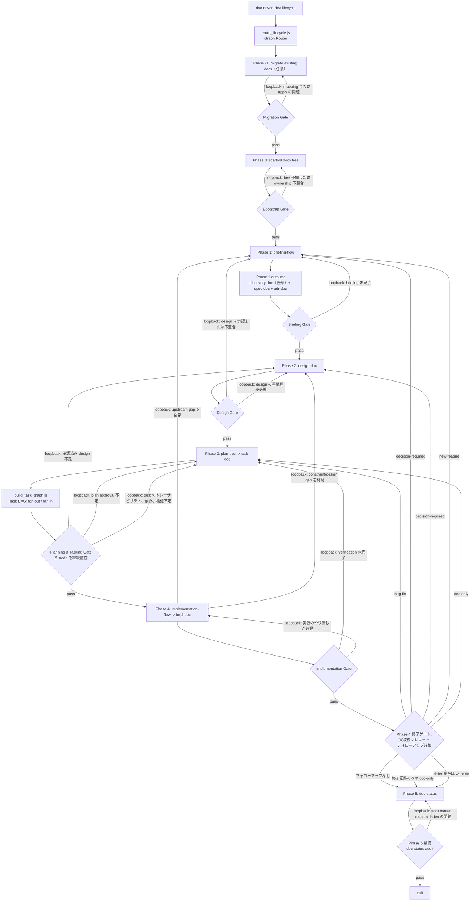

# Doc-Driven Dev APM Package

このパッケージは、spec-driven / document-driven development のための再利用可能な
skill を提供します。これらの skill が生成する文書は YAML front matter と
Markdown を使い、ADR、spec、design、plan、task、implementation record 間の
ライフサイクル状態、根拠、意味付き relation をエージェントが追跡できるようにします。

このパッケージでは `doc-driven-dev-lifecycle` をライフサイクルの中核とし、
docs tree の bootstrap、briefing、文書作成、実装準備、exit までを
オーケストレーションします。これは hierarchical graph の thin router であり、
`graphs/lifecycle.yaml` が topology/delegate、`references/flow-contract.ja.md` が
人間の承認・証跡基準、`references/lifecycle-state.ja.md` が focus、signal、
fail-closed 動作を規定します。Markdown artifact は project history の正本です。

- `migrate_docs`: 既存 Markdown docs を canonical な doc-driven-dev tree へ移行するための dry-run / apply command。
- `scaffold_docs`: briefing 開始前に canonical な `docs/` tree を bootstrap します。
- `idea-doc`: discovery や spec 化の準備が整う前の、未仕様の着想・候補テーマ・保留論点を記録します。
- `deep-dive`: コードベースを踏まえた一問一答で、意図、制約、判断軸を深掘りします。
- `briefing-flow`: 情報収集をオーケストレーションし、spec + ADR 作成へルーティングします。
- `discovery-doc`: briefing 中の探索結果・代替案比較・ギャップ分析を構造化された正本文書として記録します。
- `spec-doc`: 実装前に何を作るかを定義します。
- `adr-doc`: Architecture Decision Record を提案、作成、保守します。
- `design-doc`: planning 前の overview-first な設計成果物を作成します。
- `plan-doc`: 承認済みの spec + ADR + design を実装計画へ落とし込みます。
- `task-doc`: 実装の作業単位と依存関係を管理します。
- `impl-doc`: 実装結果と機械可読な experiment log を記録します。
- `doc-driven-dev-lifecycle`: briefing から exit までの文書ライフサイクル全体をオーケストレーションします。
- `implementation-flow`: task ごとの実装スキル選択をオーケストレーションします。
- `skill-discovery-protocol`: リポジトリ固有の skill discovery 成果物を生成・検証します。
- `doc-status`: 文書の状態、index、relation を列挙・監査します。

## 定義

### doc-driven-dev のライフサイクル

ライフサイクル本体の skill は `doc-driven-dev-lifecycle` です。必要に応じて以下の
フェーズ別 skill を呼び出しながら、mainline の文書フローを進めます。



図は人間向けの Phase model を保持する。runtime dispatch は
`route_lifecycle.js` を使い、planning では `build_task_graph.js` を Task DAG
composite として呼び出す。独立 root task は fan-out し、dependent task は全 predecessor
完了後に fan-in する。各 node を継続監査し、Phase 5 は最終 `doc-status` audit である。

- **Spec** は WHAT、WHY、SCOPE を定義します。
- **ADR** は HOW を定義し、代替案比較と採用理由を記録します。
- **並列作成**: Phase 1 で十分なコンテキストが揃ったら、spec と ADR は
  briefing の完了成果物として、同じ briefing/discovery 出力から並列に作成できます。
- **design gate**: `plan-doc` は承認済みの `design-doc` を前提にし、
  spec の要求と ADR の技術制約を取り込みます。
- **migration 境界**: `migrate_docs` は source file を保持し、`--apply` 指定時だけ
  変換済みの canonical docs を作成します。
- **bootstrap 境界**: `scaffold_docs` は canonical な `docs/` tree を作成しますが、
  `docs/designs/overview.md` は作成せず `design-doc` に任せます。
- **Phase 4 の実装記録**: `implementation-flow` と `impl-doc` は並行して動く。
  各 task はコード変更前に `in-progress` の Implementation Record を開き、
  探索が必要な場合は Experiment Log にイベントを追記し、task クローズ前に
  record を完了・監査する。
- **Phase 4 終了ゲート**: 実装後、lifecycle 利用者は完了した作業を承認済み
  spec、ADR、design、plan、task の検証証跡と照合します。フォローアップは Exit
  前に分類し、バグ修正、意思決定、新機能、文書更新、延期が孤立 task にならないようにします。
- **loopback ルール**: loopback はゲート不通過だけではありません。実装や
  レビューの途中で upstream gap が見つかった場合にも、解消のために前段へ戻ります。

ライフサイクルを構成するフェーズ skill は `idea-doc`, `deep-dive`,
`briefing-flow`, `discovery-doc`, `spec-doc`, `adr-doc`, `design-doc`,
`plan-doc`, `task-doc`, `implementation-flow`, `impl-doc`, `doc-status` に
加え、`migrate_docs` migration command と `scaffold_docs` bootstrap command
です。

### doc-driven-dev の並列トラック

spec と ADR は**並列トラック**です。同じ upstream discovery artifact から派生し、
補完関係にある異なる関心事を担当します。

| | spec-doc | adr-doc |
| --- | --- | --- |
| 答えること | What / Why / Scope | How / Which / Why-this-over-that |
| トリガー | あらゆる feature / change | 代替案を伴う技術判断 |
| plan への影響 | approved spec が必要 | accepted ADR が制約になる |
| 成果物 | 受け入れ条件 | 実装制約 |

- Phase 1 でプロダクト要件と技術判断の両方が明らかになったら、spec と ADR を
  並列で作成します。
- 作業が純粋にプロダクト要件だけなら spec のみで十分です。
- 作業が純粋に横断的な技術判断だけなら ADR のみで十分です。
- 自明に見える判断も含め、将来のエージェントが理由を追えるように ADR へ残します。

## インストール

この monorepo からインストールする場合:

```bash
pnpm clean
apm install ./packages/doc-driven-dev --target codex
```

`pnpm clean` はローカルの `node_modules` を削除してからインストールします。
これにより、配布 APM パッケージには含まれない依存関係の test fixture が
`apm install` 中のセキュリティスキャンを妨げるのを防ぎます。

公開後に利用側リポジトリからインストールする場合:

```bash
apm install scarecrow173/apm-packages#v0.1.0
```

## 検証

リポジトリルートで実行するコマンド:

```bash
pnpm --dir scripts/doc-driven-dev test
pnpm --dir scripts/doc-driven-dev run lint:md
```

`packages/doc-driven-dev/` で実行するコマンド:

```bash
apm compile --validate
apm compile --dry-run
```

## 同梱 Skill

### `deep-dive`

下流文書の信頼性を担保する前に、依頼内容をさらに掘り下げる必要があるときに使います。
実際の成果、拘束条件、判断軸をコードベース前提の対話で明確化します。出力は確認済みの
intent summary であり、それ自体では discovery artifact を生成しません。

### `briefing-flow`

要件が曖昧なとき、複数の情報源を統合したいとき、または `spec-doc` / `adr-doc`
を書く前に動的な skill 選択が必要なときに使うメタスキルです。
`skill-discovery-protocol` を通してリポジトリ固有の discovery artifact を生成し、
その場で利用可能な skill から選択しながら、Phase 1 の briefing 完了までを
駆動します。

### `idea-doc`

discovery や spec 化の準備が整う前の、未仕様の着想を `docs/ideas/` 配下に
記録します。候補テーマ、問題の兆候、保留論点を軽量な正本形式で捉えます。
ライフサイクルの中で最も軽量な文書型です。1ファイル1アイデアを原則とし、
即座の次のアクション（discovery-doc または spec-doc へ昇華、保留、廃棄）を
決めるまでが記録の単位です。

### `discovery-doc`

`docs/discovery/` 配下に構造化された discovery 文書を作成します。探索目的・論点・
代替案比較・暫定結論・未解決事項を briefing の正本 artifact として記録します。
問題空間が曖昧なとき、代替案が存在するとき、または重大な調査を行ったときに使います。
spec-doc と adr-doc の派生元となる上流起点文書です。

### `adr-doc`

MADR 4.0.0 形式の ADR を提案、作成、保守する skill です。リポジトリ走査、
ドラフト作成、レビュー、保守まで ADR の全ワークフローを扱います。判断そのものの
深掘りが必要なら `deep-dive` へ委譲し、意図が具体化してから戻ります。

- MADR テンプレートから新しい ADR を作成する
- ADR 固有の不足情報だけを質問し、深掘りが必要なら missing-input request を出す
- コーディングエージェント向けの実装計画と検証条件を書く
- ADR 一覧と agent-readiness を確認する
- ADR 構造と index 整合性を監査する
- Implementation Plan のコードリンクと ADR relation を管理する
- ADR index を再生成する
- ファイル変更なしで migration report を生成する

### `spec-doc`

`docs/specs/` 配下に YAML front matter 付き spec を作成します。spec は
実装計画の前に、意図、範囲、要求、受け入れ条件、根拠を記録します。

### `design-doc`

`docs/designs/` 配下に設計成果物を作成します。必須の `overview.md` と
詳細設計文書を管理し、`plan-doc` に対する hard gate として機能します。

### `plan-doc`

`docs/plans/` 配下に実装計画を作成します。plan は upstream spec と
`relations.implements` で、design / ADR 入力と `relations.derives-from` で結びます。

### `task-doc`

`docs/tasks/` 配下に実装 task を作成します。task は plan と
`relations.implements`、依存関係と `relations.depends-on` で結び、
task 専用の lifecycle status を使います。

### `impl-doc`

`docs/impl/ir/` 配下の Implementation Record と `docs/impl/exp/` 配下の
Experiment Log を扱います。Implementation Record については CLI ベースの
作成・監査、Experiment Log については CLI ベースの作成・追記・編集・監査を提供します。
`doc-driven-dev-lifecycle` の Phase 4 では、`impl-doc` は実装後だけでなく
task 開始時に使う。既知解の task でも `in-progress` の Implementation Record は
作成し、任意なのは Experiment Log だけである。

### `doc-status`

生成済み文書の列挙と監査に使います。必須 front matter、status 値、ローカル relation
target、index coverage を検証しつつ、`relations.source` では外部 URL を許可します。

### `doc-driven-dev-lifecycle`

briefing から implementation / exit まで、フェーズゲート付きで end-to-end の
文書ライフサイクル全体を進めたいときに使うメタスキルです。

### `implementation-flow`

`task-doc` による分解後、現在の環境で利用可能な実装 skill を task 単位で発見し、
順序付けるメタスキルです。

### `skill-discovery-protocol`

インストール済み skill を走査し、推論した capability metadata を作り、
flow-neutral な catalog と flow-specific な profile を構築し、
生成された `.sdp` 成果物を検証するメタスキルです。

### オーケストレーション Skill

これらのオーケストレーション skill は Phase 1 (Briefing)、Phase 4
(Implementation)、およびリポジトリ固有の skill discovery の周辺で動作します。
固定の workflow-skill stack を同梱するのではなく、その場の環境で利用可能な skill を
発見してルーティングします。

| Skill | 役割 |
| --- | --- |
| `doc-driven-dev-lifecycle` | 5 フェーズ文書ライフサイクルの graph-backed thin router |
| `briefing-flow` | メタスキル: briefing 作業を利用可能な discovery/document skill にルーティング |
| `implementation-flow` | メタスキル: task を workflow skill にルーティング |
| `skill-discovery-protocol` | メタスキル: skill discovery 成果物を生成・検証 |

## 共通 Relation

新しく生成される spec、design、plan、task は次の semantic relation fields を使います。

```yaml
relations:
  source: []
  changes:
    added: []
    modified: []
    deleted: []
    renamed: []
    moved: []
    generated: []
  implements: []
  implemented-by: []
  depends-on: []
  blocks: []
  supersedes: []
  superseded-by: []
  related: []
  refines: []
  refined-by: []
  derives-from: []
  derived-by: []
  verifies: []
  verified-by: []
  references: []
  defers: []
  deferred-by: []
```

`source` は外部根拠と primary source に使います。`references` は補助資料に使います。
それ以外の field は、リンク先文書の種類ではなく、内部文書リンクの意味を表すために使います。

## `doc-driven-dev-lifecycle` によるライフサイクル

```text
doc-driven-dev-lifecycle
  -> Phase -1: migrate existing docs      (任意; apply 前に dry-run)
  -> Phase 0: scaffold docs tree          (canonical docs tree; design overview は design-doc 所有)
  -> Phase 1: briefing-flow
  -> Phase 1 outputs: discovery-doc（任意）+ spec-doc + adr-doc  (discovery で探索を永続化；spec + adr は並列)
  -> Phase 2: design-doc                  (overview-first design gate)
  -> Phase 3: plan-doc -> task-doc（task 作成前に plan 承認）
  -> Phase 4: implementation-flow -> impl-doc
  -> Phase 4 終了ゲート: 実装後レビュー + フォローアップ分類
  -> Phase 5: doc-status -> exit
```

`doc-driven-dev-lifecycle` がライフサイクルの entrypoint です。`migrate_docs` は
bootstrap 前に既存 Markdown docs を移行できます。`scaffold_docs` が Phase 1 前に
canonical な `docs/` tree を bootstrap し、`briefing-flow` と
`implementation-flow` は、このライフサイクル内部のフェーズ別オーケストレーション
skill であり、別個のトップレベルライフサイクルではありません。これらのメタスキルは、
固定の補助 skill stack を前提にせず、その場で利用可能な skill から選択して進みます。
並列トラックは `spec-doc` + `adr-doc` のままで、spec は何を作るか、なぜ必要か、
範囲、受け入れ条件を定義し、ADR は技術判断、代替案、採用理由を記録します。
Phase 1 で両方に十分な文脈が揃ったら briefing の完了成果物として並列に作成し、
その後 design と planning へ進みます。Phase 4 では `implementation-flow` と
`impl-doc` が並行して動き、各 task は `in-progress` の Implementation Record を
開くか再利用してから着手し、探索が必要な場合は Experiment Log にイベントを追記し、
task クローズ前に record を完了し、監査します。

### 既存 Docs の Migration

まず dry-run します:

```bash
node .apm/skills/doc-driven-dev-lifecycle/scripts/migrate_docs.js --from docs --json
```

Mapping を確認してから apply します:

```bash
node .apm/skills/doc-driven-dev-lifecycle/scripts/migrate_docs.js --from docs --split-h1 --apply
```

この command は source file を保持し、既存の canonical target を上書きしません。

Routing note: `briefing-flow` と `implementation-flow` は、現在の環境で発見された
skill にルーティングできます。`steer-web-research` のような optional skill は
この package に bundle されておらず、consumer environment で生成された `.sdp`
profile に存在する場合だけ使われます。
