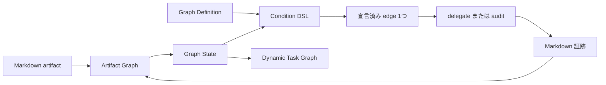

# Doc-Driven Dev APM Package

`doc-driven-dev-graph` はドキュメント駆動開発の公開 entrypoint です。正規
Markdown artifact を Graph State に投影し、選択した Graph Definition を評価して、
delegate または audit への宣言済みエッジを最大 1 つ、または明示的な terminal/blocked
結果を返します。人間向けの phase label
は語彙として利用できますが、実行の authority は Graph Definition です。

## 同梱内容

目的別の document skill と graph delegate を提供します。

- `idea-doc`、`deep-dive`、`briefing-flow`: 探索の記録と整理。
- `discovery-doc`、`adr-doc`、`spec-doc`: 意図と判断の記録。
- `design-doc`、`plan-doc`、`task-doc`: 承認済み実装作業の定義。
- `impl-doc`: 実装と実験の証跡。
- `doc-status`: document contract とリンクの audit。
- `implementation-flow`: 実装作業と review gate の委譲。
- `skill-discovery-protocol`: 利用可能な skill と adapter の発見。
- `doc-driven-dev-graph`: 1 エッジの routing と Task Graph の合成。

## Graph model

runtime は 4 つの明示的な layer で構成されます。

1. **Execution Graph** — `graphs/doc-driven-dev.yaml` が node、edge、
   condition、priority、delegate、audit を宣言する。
2. **Artifact Graph** — 正規 Markdown が ID、type、status、semantic relation
   を提供する。
3. **Graph State** — 各 route で Artifact Graph を投影し、focus、gate、signal、
   blocker、証跡を得る。
4. **Dynamic Task Graph** — focus された plan を planning / implementation 用の
   決定的な task dependency に投影する。



loop は `Graph Definition -> Graph State -> 宣言済み route 1つ ->
delegate/audit -> Markdown 証跡 -> 再投影` です。Definition にない遷移を phase
label から追加してはいけません。

### Condition DSL と priority

汎用 condition DSL は次を提供します。

- `signal`: caller または projection が宣言した signal を確認。
- `gate`: `pass` または `not-pass` の named gate を確認。
- `task-graph`: task projection の `runnable` または `invalid` を確認。

current node の eligible edge は昇順の `priority`、次に安定した edge ID で並べ、
最初の 1 つだけ返します。terminal は idempotent な結果、blocked は fail-closed な
結果であり、遷移先を推測しません。

### Delegate と subgraph

binding は Graph Definition に宣言されています。

- migration: `migrate_docs`; bootstrap: `scaffold_docs`。
- briefing: `briefing-flow`; design: `design-doc`。
- planning の binding `build_task_graph` は `build_task_graph.js` が実行。
- implementation: `implementation-flow`; exit audit: `doc-status`。

委譲された skill が briefing / implementation subgraph を担当します。caller は
返された audit をすべて実行してから、返された delegate だけを dispatch します。
`focus-required` は明示的 focus が渡されるまで hard stop です。

### Task Graph invariant

Task document が authority です。`depends-on` と `blocks` を安定した ID の有向
edge に変換します。全 predecessor が `done` のときだけ runnable であり、
`wont-do` は dependency を満たしません。重複 ID、未解決参照、cycle、壊れた
relation、空の選択は issue と空の runnable 集合になります。

### Persistence boundary

Markdown が durable history と status の authority です。Graph State と Dynamic
Task Graph は現在の turn の projection であり、runtime は並行する lifecycle
database を作成せず、要求もしません。

## インストール

APM からインストールします。

```bash
apm install doc-driven-dev
```

配布 asset は `.apm/skills/` にあります。この repository の source と test は
`scripts/doc-driven-dev/` にあります。

## 検証

repository root から実行します。

```bash
pnpm --dir scripts/doc-driven-dev test
pnpm --dir scripts/doc-driven-dev run lint:md
```

consumer repository で route を確認するには次を使います。

```bash
node .apm/skills/doc-driven-dev-graph/scripts/route_graph.js \
  [--graph <path>] [--current <node>] [--signal <condition-signal>] \
  [--focus <artifact>] [--task-dir <path>] [--cwd <path>] --json
```

## 共通 relation

front matter relation で document graph を保持します。

- `source`: discovery / research の証跡。
- `implements`: design、plan、task から上流 contract へのリンク。
- `derives-from`: design と planning の導出元。
- `references`: 補足 document。
- `defers` / `deferred-by`: 保留した scope。
- `changes`: added、modified、deleted、renamed、moved、generated path。

file 名や directory の近さから ownership を推測しないでください。canonical ID
と relation を使い、事実が衝突したら focus 解決を fail closed にします。

## Graph runtime command

`route_graph.js` は 1 turn を実行します。

1. Graph Definition と current node を選ぶ。
2. 正規 Markdown を Graph State に投影する。
3. focus、gate、signal、blocker を評価する。
4. condition DSL と priority 順を評価する。
5. edge 1 つ、terminal、または blocked を返す。
6. required audit を実行し、delegate を dispatch して Markdown 証跡を記録する。
7. 再投影して `next` から再入力する。

公開 skill は完全な 10 ステップ loop と GraphRoute JSON contract を説明します。
schema と gate の詳細は次を参照してください。

- `.apm/skills/doc-driven-dev-graph/references/graph-contract.ja.md`
- `.apm/skills/doc-driven-dev-graph/references/graph-state.ja.md`
- `.apm/skills/doc-driven-dev-graph/references/execution-contract.ja.md`
- `.apm/skills/doc-driven-dev-graph/references/task-graph-contract.ja.md`

## 既存 docs の migration

適用前に preview します。

```bash
node .apm/skills/doc-driven-dev-graph/scripts/migrate_docs.js --from docs --json
```

preview を確認してから適用します。

```bash
node .apm/skills/doc-driven-dev-graph/scripts/migrate_docs.js \
  --from docs --split-h1 --apply
```

不足している canonical tree は `scaffold_docs.js` で bootstrap し、生成された
証跡を `doc-status` で audit してください。
