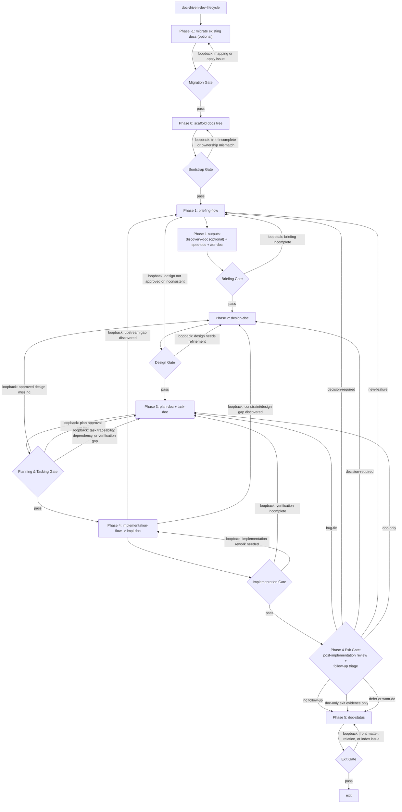

# Doc-Driven Dev APM Package

This package provides reusable skills for spec-driven and document-driven
development. Documents created by these skills use YAML front matter plus
Markdown so agents can track lifecycle status, source evidence, and semantic
relations between ADRs, specs, designs, plans, tasks, and implementation
records.

The package centers the lifecycle in `doc-driven-dev-lifecycle`, which orchestrates
docs tree bootstrap, briefing, document creation, implementation preparation,
and exit:

- `migrate_docs`: dry-run or apply migration of existing Markdown docs into the canonical doc-driven-dev tree.
- `scaffold_docs`: bootstrap the canonical `docs/` tree before briefing starts.
- `idea-doc`: capture raw, unformalized ideas before they are ready for discovery or specification.
- `deep-dive`: interrogate intent, constraints, and decision axes through codebase-aware, one-question-at-a-time dialogue.
- `briefing-flow`: orchestrate information gathering and route to spec + ADR creation.
- `discovery-doc`: record briefing exploration results, alternative comparisons, and gap analysis as a structured canonical document.
- `spec-doc`: define what to build before implementation starts.
- `adr-doc`: propose, draft, and maintain Architecture Decision Records.
- `design-doc`: capture overview-first design artifacts before planning.
- `plan-doc`: turn approved spec + ADR + design into an implementation plan.
- `task-doc`: track implementation slices and dependencies.
- `impl-doc`: record implemented outcomes and machine-readable implementation experiments.
- `doc-driven-dev-lifecycle`: orchestrate the full document lifecycle from briefing through exit.
- `implementation-flow`: orchestrate implementation-phase skill selection per task.
- `skill-discovery-protocol`: generate and validate repository-specific skill discovery artifacts.
- `doc-status`: list and audit document status, indexes, and relations.

## Definitions

### doc-driven-dev lifecycle

The lifecycle skill is `doc-driven-dev-lifecycle`. It orchestrates the mainline
document flow and invokes the phase-specific skills below as needed:



- **Spec** answers WHAT, WHY, and SCOPE.
- **ADR** answers HOW and records every technical decision with alternatives
  considered and rationale.
- **Parallel creation**: when Phase 1 produces enough context, both spec and
  ADR can be written simultaneously as the completion artifacts of briefing,
  since they address different facets of the same work.
- **Design gate before planning**: `plan-doc` requires approved `design-doc`
  input and uses spec for requirements plus ADR for technical constraints.
- **Migration boundary**: `migrate_docs` preserves source files and creates
  converted canonical docs only when run with `--apply`.
- **Bootstrap boundary**: `scaffold_docs` creates the canonical `docs/` tree
  without `docs/designs/overview.md`; `design-doc` owns that file.
- **Phase 4 implementation documentation**: `implementation-flow` and
  `impl-doc` run together. Each task opens an `in-progress` Implementation
  Record before code changes, appends Experiment Log events when exploration is
  needed, and completes and audits the record before task closure.
- **Phase 4 Exit Gate**: after implementation, lifecycle users must compare
  completed work against the approved spec, ADR, design, plan, and task
  verification evidence. Follow-ups are classified before exit so bug fixes,
  decisions, new features, documentation updates, and deferrals do not become
  orphan tasks.
- **Loopback rules**: loopbacks are not limited to gate failures. They also
  apply when implementation or review uncovers an upstream gap that must be
  resolved before the lifecycle can continue.

Lifecycle phase skills: `idea-doc`, `deep-dive`, `briefing-flow`,
`discovery-doc`, `spec-doc`, `adr-doc`, `design-doc`, `plan-doc`, `task-doc`,
`implementation-flow`, `impl-doc`, `doc-status`, plus the `migrate_docs`
migration command and `scaffold_docs` bootstrap command.

### doc-driven-dev parallel track

Spec and ADR form a **parallel track**: two documents derived from the same
upstream discovery artifact, addressing complementary concerns:

| | spec-doc | adr-doc |
| --- | --- | --- |
| Answers | What / Why / Scope | How / Which / Why-this-over-that |
| Trigger | any feature or change | technical decisions with alternatives |
| Blocking effect | planning requires an approved spec | planning is constrained by accepted ADRs |
| Output | acceptance criteria | implementation constraints |

- When Phase 1 reveals both product requirements and technical decisions, write
  spec and ADR in parallel.
- When the work is purely product (no architecture choice), spec alone
  suffices.
- When the decision is purely cross-cutting (no single feature), ADR alone
  suffices.
- All decisions, including those that seem obvious, are recorded as ADRs so
  future agents understand rationale.

## Install

From this monorepo:

```bash
pnpm clean
apm install ./packages/doc-driven-dev --target codex
```

`pnpm clean` removes local `node_modules` before installation. This prevents
security scans in `apm install` from being blocked by transitive dependency test
fixtures that are not part of the distributed APM package contents.

From a consumer repository after publication:

```bash
apm install scarecrow173/apm-packages#v0.1.0
```

## Validate

Repository-root commands:

```bash
pnpm --dir scripts/doc-driven-dev test
pnpm --dir scripts/doc-driven-dev run lint:md
```

Run these from `packages/doc-driven-dev/`:

```bash
apm compile --validate
apm compile --dry-run
```

## Included Skills

### `deep-dive`

Use this skill when the request needs deeper interrogation before downstream
documents are trustworthy. It clarifies the real outcome, the binding
constraints, and the decision axes through codebase-aware dialogue. The output
is a confirmed intent summary; it does not create a discovery artifact by
itself.

### `briefing-flow`

Use this meta skill when requirements are ambiguous, multiple information
sources must converge, or you need dynamic skill selection before writing
`spec-doc` / `adr-doc`. It generates repository-specific discovery artifacts
through `skill-discovery-protocol` and drives Phase 1 briefing completion by
selecting from the skills available in the current environment.

### `adr-doc`

Use this skill to propose, draft, and maintain MADR 4.0.0 ADRs. It keeps the
full ADR workflow, including repository scan, drafting, review, and maintenance
operations. When the decision itself still needs deeper interrogation, hand off
that clarification work to `deep-dive` and return once the intent is concrete.

- create a new ADR from a MADR template
- ask only ADR-specific gap-fill questions or emit missing-input requests when
  deeper clarification is still needed
- write implementation plans and verification criteria for coding agents
- list ADRs and review agent-readiness
- audit ADR structure and index consistency
- check Implementation Plan code links and manage ADR relations
- rebuild the ADR index
- produce migration reports without changing files

### `idea-doc`

Use this skill to capture raw, unformalized ideas under `docs/ideas/` before
they are ready for deeper exploration or specification. An idea document records
a candidate topic, a problem signal, or a deferred point in a lightweight
canonical form. It is the lightest document type in the lifecycle. Write one
idea per file and record the immediate next action: promote to `discovery-doc`
or `spec-doc`, park, or discard.

### `discovery-doc`

Use this skill to create structured discovery documents under `docs/discovery/`.
Discovery documents capture exploration goals, key issues, alternative
comparisons, tentative conclusions, and open questions from briefing as a
formal canonical artifact. Use them when the problem space is ambiguous,
alternatives exist, or significant research was done. They are the upstream
source that spec-doc and adr-doc derive from.

### `spec-doc`

Use this skill to create YAML-front-matter specs under `docs/specs/`. Specs
capture intent, scope, requirements, acceptance criteria, and source evidence
before implementation planning starts.

### `design-doc`

Use this skill to create design artifacts under `docs/designs/`. It maintains
required `overview.md` plus detailed design docs and acts as a hard gate for
`plan-doc`.

### `plan-doc`

Use this skill to create implementation plans under `docs/plans/`. Plans link
to upstream specs with `relations.implements`, and to design/ADR inputs with
`relations.derives-from`.

### `task-doc`

Use this skill to create implementation tasks under `docs/tasks/`. Tasks link
to their plan with `relations.implements` and `relations.depends-on`, and use
task-specific lifecycle statuses.

### `impl-doc`

Use this skill to create implementation records under `docs/impl/ir/` and
experiment logs under `docs/impl/exp/`. It provides CLI-based creation and
auditing for Implementation Records, plus CLI-based creation, append, edit, and
audit flows for Experiment Logs.
During `doc-driven-dev-lifecycle` Phase 4, `impl-doc` is used at task start,
not only after implementation. A known-solution task still creates an
`in-progress` Implementation Record; only the Experiment Log is optional.

### `doc-status`

Use this skill to list and audit generated documents. It validates required
front matter, status values, local relation targets, and index coverage while
allowing external source URLs in `relations.source`.

### `doc-driven-dev-lifecycle`

Use this meta skill when you need the full end-to-end document lifecycle
orchestrated with phase gates from briefing through implementation and exit.

### `implementation-flow`

Use this meta skill after `task-doc` decomposition to discover and sequence the
implementation skills available in the current environment on a per-task basis.

### `skill-discovery-protocol`

Use this meta skill to scan installed skills, infer capability metadata, build
flow-neutral catalogs and flow-specific profiles, and validate generated `.sdp`
artifacts.

### Orchestration Skills

These orchestration skills activate around Phase 1 (Briefing), Phase 4
(Implementation), and repository-specific skill discovery. They do not bundle a
fixed workflow-skill stack; instead they discover and route whatever skills are
available in the current environment.

| Skill | Purpose |
| --- | --- |
| `doc-driven-dev-lifecycle` | Meta skill: orchestrates the full five-phase document lifecycle |
| `briefing-flow` | Meta skill: routes briefing work to the available discovery/document skills |
| `implementation-flow` | Meta skill: routes tasks to workflow skills via discovery tree |
| `skill-discovery-protocol` | Meta skill: builds and validates skill discovery artifacts |

## Shared Relations

New generated specs, designs, plans, and tasks use semantic relation fields:

```yaml
relations:
  source: []
  changes:
    added: []
    modified: []
    deleted: []
    renamed: []
    moved: []
    generated: []
  implements: []
  implemented-by: []
  depends-on: []
  blocks: []
  supersedes: []
  superseded-by: []
  related: []
  refines: []
  refined-by: []
  derives-from: []
  derived-by: []
  verifies: []
  verified-by: []
  references: []
  defers: []
  deferred-by: []
```

Use `source` for external evidence and primary sources. Use `references` for
supplementary material. Use the remaining fields to describe the meaning of
internal document links rather than the type of the linked document.

## Lifecycle via `doc-driven-dev-lifecycle`

```text
doc-driven-dev-lifecycle
  -> Phase -1: migrate existing docs      (optional; dry-run before apply)
  -> Phase 0: scaffold docs tree          (canonical docs tree; design overview remains design-doc-owned)
  -> Phase 1: briefing-flow
  -> Phase 1 outputs: discovery-doc (optional) + spec-doc + adr-doc  (discovery persists exploration; spec + adr parallel)
  -> Phase 2: design-doc                  (overview-first design gate)
  -> Phase 3: plan-doc -> task-doc (plan approval before task creation)
  -> Phase 4: implementation-flow -> impl-doc
  -> Phase 4 Exit Gate: post-implementation review + follow-up triage
  -> Phase 5: doc-status -> exit
```

`doc-driven-dev-lifecycle` is the lifecycle entrypoint. `migrate_docs` can
migrate existing Markdown docs before bootstrap; `scaffold_docs` bootstraps the
canonical `docs/` tree before Phase 1; `briefing-flow` and
`implementation-flow` remain phase-level orchestration skills inside that
lifecycle, not separate top-level lifecycles. These meta skills select from the
skills available in the current environment rather than hardcoding a fixed
supporting-skill stack. The dual-track model remains `spec-doc` + `adr-doc`:
specs define what should be built, why, scope, and acceptance criteria, while
ADRs record technical decisions, alternatives, and rationale. When Phase 1
produces enough context for both, they are written in parallel as briefing
completion artifacts before design and planning continue. In Phase 4,
`implementation-flow` and `impl-doc` run together so each task starts by
opening or reusing an `in-progress` Implementation Record, adds Experiment Log
events when exploratory work is needed, and completes and audits the record
before the task closes.

### Migrating Existing Docs

Run dry-run first:

```bash
node .apm/skills/doc-driven-dev-lifecycle/scripts/migrate_docs.js --from docs --json
```

Apply only after reviewing the mapping:

```bash
node .apm/skills/doc-driven-dev-lifecycle/scripts/migrate_docs.js --from docs --split-h1 --apply
```

The command preserves source files and never overwrites existing canonical targets.

Routing note: `briefing-flow` and `implementation-flow` can route to skills
discovered in the current environment. Optional skills such as
`steer-web-research` are not bundled in this package and are used only when
they appear in the generated `.sdp` profile for the consumer environment.
