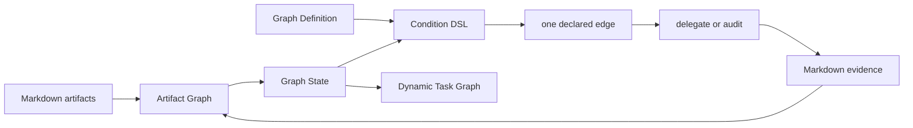

# Doc-Driven Dev APM Package

`doc-driven-dev-graph` is the public entrypoint for document-driven
development. It projects canonical Markdown artifacts into Graph State,
evaluates the selected Graph Definition, and returns at most one declared edge
or an explicit terminal/blocked result for a delegate or audit. Human phase labels are useful vocabulary, but the Graph
Definition is the execution authority.

## What is included

The package provides focused document skills and graph delegates:

- `idea-doc`, `deep-dive`, and `briefing-flow` capture and shape discovery.
- `discovery-doc`, `adr-doc`, and `spec-doc` record intent and decisions.
- `design-doc`, `plan-doc`, and `task-doc` define approved implementation work.
- `impl-doc` records implementation and experiment evidence.
- `doc-status` audits document contracts and links.
- `implementation-flow` delegates implementation work and review gates.
- `skill-discovery-protocol` discovers compatible skills and adapters.
- `doc-driven-dev-graph` selects one graph edge and composes the Task Graph.

## Graph model

The runtime has four explicit layers:

1. **Execution Graph** — `graphs/doc-driven-dev.yaml` declares nodes, edges,
   conditions, priorities, delegates, and audits.
2. **Artifact Graph** — canonical Markdown files provide IDs, types, statuses,
   and semantic relations.
3. **Graph State** — each route projects the Artifact Graph with focus, gates,
   signals, blockers, and evidence.
4. **Dynamic Task Graph** — a focused plan is projected into deterministic task
   dependencies for planning and implementation.



The loop is `Graph Definition -> Graph State -> one declared route ->
delegate/audit -> Markdown evidence -> re-project`. A phase label never adds a
transition that is absent from the definition.

### Conditions and priority

The condition DSL is generic across graphs:

- `signal` checks a declared caller or derived signal.
- `gate` checks a named gate with `pass` or `not-pass` status.
- `task-graph` checks `active`, `runnable`, `invalid`, or `idle` task
  projection state.

For one current node, eligible edges are sorted by ascending `priority`, then
stable edge ID. The router returns the first match only. A terminal result is
idempotent; a blocked result is fail-closed and never guesses a destination.
`tasks-active` has priority over `tasks-runnable`, resuming eligible active
work before starting new work.

### Delegates and subgraphs

Bindings are declared in the Graph Definition:

- migration: `migrate_docs`; bootstrap: `scaffold_docs`;
- briefing: `briefing-flow`; design: `design-doc`;
- planning binding `build_task_graph`, executed by `build_task_graph.js`;
- implementation: `implementation-flow`; exit audit: `doc-status`.

Delegated skills own their briefing or implementation subgraphs. The caller
runs every returned audit before dispatching exactly the returned delegate.
`focus-required` is a hard stop until a caller supplies explicit focus.

### Task Graph invariant

Task documents remain authoritative. `depends-on` and `blocks` relations become
directed edges with stable IDs. A task is runnable only when all predecessors
are `done`; `wont-do` never satisfies a dependency. Duplicate IDs, unresolved
references, cycles, malformed relations, or an empty selection produce issues
and an empty runnable set.

### Persistence boundary

Markdown is durable history and status authority. Graph State and the Dynamic
Task Graph are projections for the current turn. The runtime creates no
parallel lifecycle database and does not require one.

## Install

Install the package with APM:

```bash
apm install doc-driven-dev
```

The distributed assets live under `.apm/skills/`. Source and tests for this
package are under `scripts/doc-driven-dev/` in this repository.

## Validate

From the repository root:

```bash
pnpm --dir scripts/doc-driven-dev test
pnpm --dir scripts/doc-driven-dev run lint:md
```

To inspect the route from a consumer repository:

```bash
node .apm/skills/doc-driven-dev-graph/scripts/route_graph.js \
  [--graph <path>] [--current <node>] [--signal <condition-signal>] \
  [--focus <artifact>] [--task-dir <path>] [--cwd <path>] --json
```

## Shared relations

Use front matter relations to preserve the document graph:

- `source` links discovery and research evidence.
- `implements` links a design, plan, or task to its upstream contract.
- `derives-from` records design and planning derivation.
- `references` records supporting documents.
- `defers` and `deferred-by` make deferred scope explicit.
- `changes` records added, modified, deleted, renamed, moved, and generated
  paths.

Do not infer ownership from file names or directory proximity. Use canonical
IDs and relations so focus resolution can fail closed when facts conflict.

## Graph runtime command

`route_graph.js` performs one turn:

1. select the Graph Definition and current node;
2. project canonical Markdown into Graph State;
3. resolve focus and evaluate gates, signals, and blockers;
4. evaluate the condition DSL and priority order;
5. return one edge, terminal, or blocked result;
6. run required audits, dispatch the declared delegate, and record Markdown
   evidence;
7. re-project and re-enter from `next`.

The public skill documents the complete ten-step loop and the corresponding
GraphRoute JSON contract. See its references for schema and gate details:

- `.apm/skills/doc-driven-dev-graph/references/graph-contract.md`
- `.apm/skills/doc-driven-dev-graph/references/graph-state.md`
- `.apm/skills/doc-driven-dev-graph/references/execution-contract.md`
- `.apm/skills/doc-driven-dev-graph/references/task-graph-contract.md`

## Migrating existing docs

Preview a migration before applying it:

```bash
node .apm/skills/doc-driven-dev-graph/scripts/migrate_docs.js --from docs --json
```

Apply only after reviewing the preview:

```bash
node .apm/skills/doc-driven-dev-graph/scripts/migrate_docs.js \
  --from docs --split-h1 --apply
```

Bootstrap a missing canonical tree with `scaffold_docs.js`, then use
`doc-status` to audit the generated evidence.
