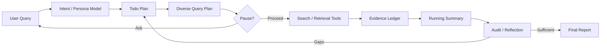

# 設計メモ

## SteER からの対応付け

| SteER の概念 | このパッケージでの実装 |
|---|---|
| 処理途中のステアリング | 適応的な停止・確認判断セクション |
| コスト・ベネフィットによる確認判断 | `pause_gain` ルーブリック |
| 多様性を考慮した計画 | 多様な検索方向の生成 |
| alignment、novelty、coverage に対する効用 | 検索選択と監査基準 |
| live persona model | `research/persona.md` |
| research tree | タスク依存関係を持つ `research/todo.md` |
| 最終統合 | `research/final-report.md` |

## Enterprise Deep Research からの対応付け

| EDR の概念 | このパッケージでの実装 |
|---|---|
| Master Planning Agent | Copilot / Codex custom agent profile |
| ToDo Manager | `research/todo.md` |
| Specialized search agents | ドメイン別検索ガイダンス |
| MCP ecosystem | `docs/mcp-notes.md` |
| Reflection mechanism | `research/audit.md` と内省ループ |
| Evidence transparency | `research/evidence-ledger.md` |
| Real-time steering | 確認判断と steering queue の指針 |

## アーキテクチャ

## 実用上の制約

Codex と GitHub Copilot のホスト環境では、ツール名や権限が異なる。そのため、このエージェントプロファイルは特定の web-search ツール名をハードコードしない。代わりに、ホストエージェントが利用可能な search、fetch、repository、file、MCP ツールを使うよう指示する。

## 情報源信頼性ルーブリック

| ラベル | 意味 |
|---|---|
| primary | 公式ドキュメント、原論文、ソースリポジトリ、標準化団体 / 規制当局 |
| high | 信頼できる報道、確立された調査機関、よく保守されたドキュメント |
| medium | 専門家ブログ、コミュニティドキュメント、パッケージメタデータ |
| low | フォーラム / SNS / SEO / 出典のないコンテンツ |

## 終了ルール

回答がもっともらしいという理由で終了してはならない。監査で回答の証拠十分性が確認された場合、または残るギャップを開示し、追加の対象検索では解消しにくいと判断できる場合だけ終了する。
