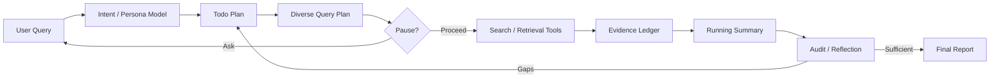

# Design Notes

## Mapping from SteER

| SteER concept | Implementation in this package |
|---|---|
| Mid-process steering | Adaptive pause decision section |
| Cost-benefit pause decision | `pause_gain` rubric |
| Diversity-aware planning | Diverse search direction generation |
| Utility for alignment, novelty, coverage | Search selection and audit criteria |
| Live persona model | `research/persona.md` |
| Research tree | `research/todo.md` with task dependencies |
| Final synthesis | `research/final-report.md` |

## Mapping from Enterprise Deep Research

| EDR concept | Implementation in this package |
|---|---|
| Master Planning Agent | Copilot/Codex custom agent profile |
| ToDo Manager | `research/todo.md` |
| Specialized search agents | Domain-specific search guidance |
| MCP ecosystem | `docs/mcp-notes.md` |
| Reflection mechanism | `research/audit.md` and reflection loop |
| Evidence transparency | `research/evidence-ledger.md` |
| Real-time steering | Pause decision and steering queue guidance |

## Architecture

## Practical Constraints

Codex and GitHub Copilot hosts differ in tool names and permissions. Therefore the agent profile intentionally avoids hard-coding a web-search tool name. It instructs the host agent to use whatever search, fetch, repository, file, or MCP tools are available.

## Source Reliability Rubric

| Label | Meaning |
|---|---|
| primary | Official docs, original paper, source repo, standards/regulator |
| high | Reputable journalism, established research org, well-maintained docs |
| medium | Expert blog, community docs, package metadata |
| low | Forum/social/SEO/unsourced content |

## Termination Rule

Do not terminate because an answer is plausible. Terminate only when the audit says the answer is evidence-sufficient, or when remaining gaps are disclosed and unlikely to be resolved by another targeted search.
